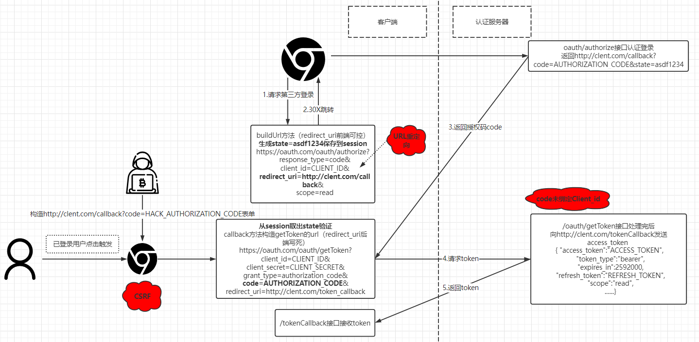
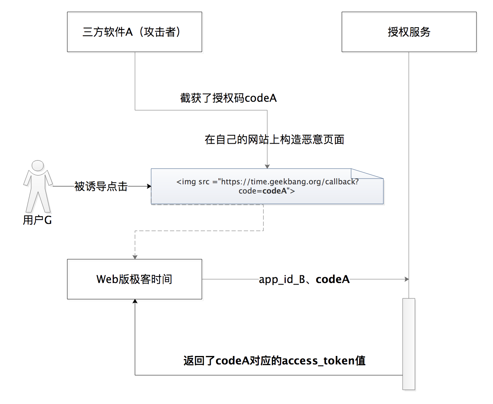
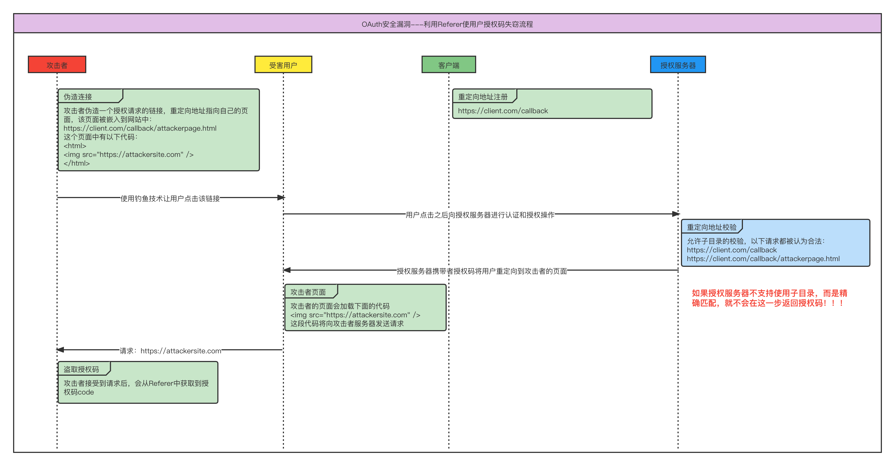
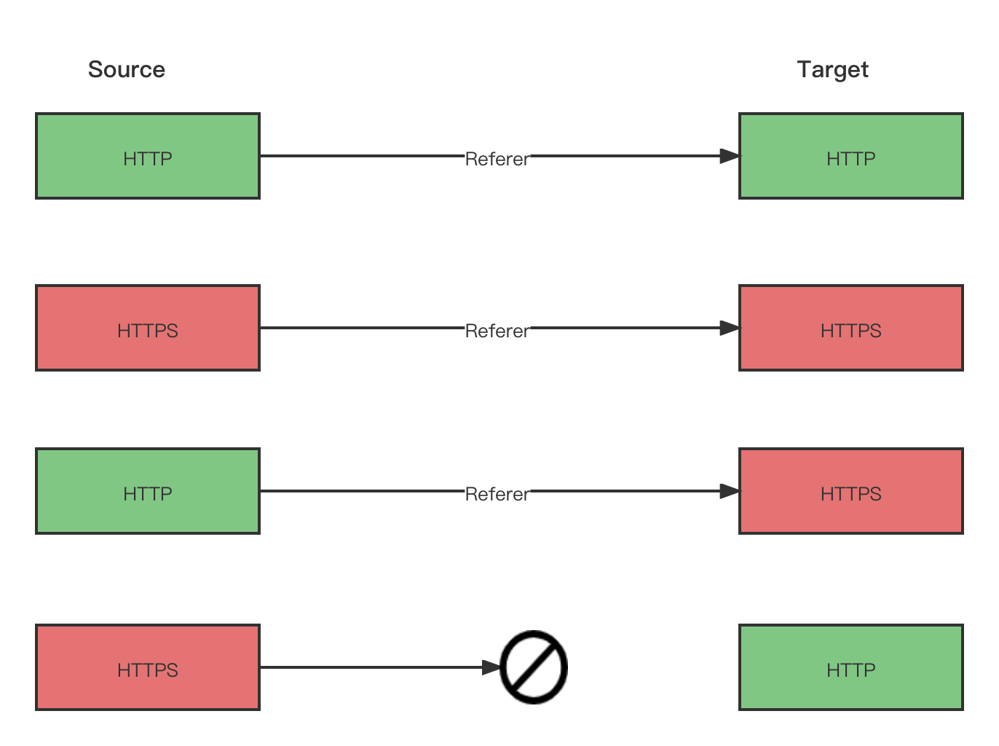
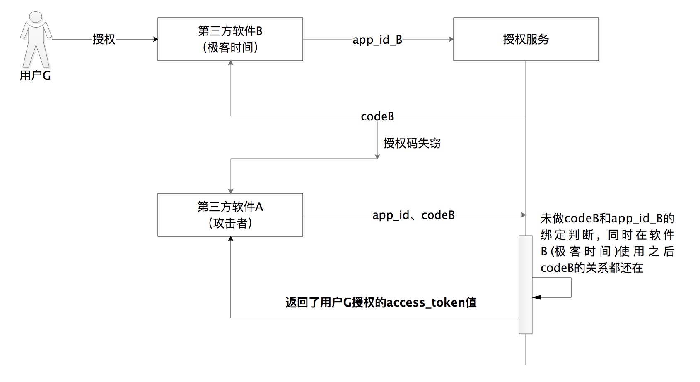
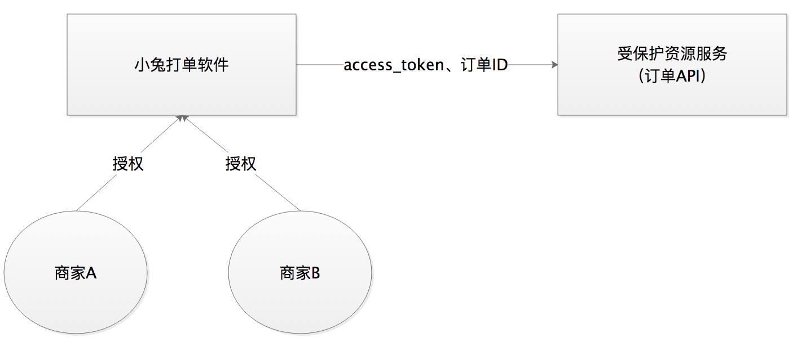

# 前言

开局一张图



根据自己对Oauth2.0授权码模式的理解简单画了个图，图中包含了Oauth2.0授权码模式的流程和oauth的几个常见的特性漏洞。网上oauth的图很多很多，但是总感觉别人画的始终是别人的理解，不根据自己的理解画一遍都不知道自己哪里不会（菜鸡的感慨\~）

接下来挨个简介下标红的三种问题，下面的问题描述都较为简单，主要是作为自己的笔记记录，不做教程性的介绍，若想要看详细的原理介绍，推荐[参考链接](#参考链接)的几个好文

# 1.通过CSRF将攻击者code绑定受害者token

一句话描述：攻击者通过CSRF漏洞，使已登录的用户把攻击者的CODE拿去授权服务器获取accces\_token令牌，攻击者就可以通过accces\_token令牌访问被绑定用户的资源服务器



防御方法：**在请求授权码时，增加随机state参数（通常是6为字母加数字），在返回授权码的回调接口中验证state参数是否和发送的相同**，这样可以确保授权码和授权请求是由同一个用户发起的

# 2.URL重定向导致code泄露

这个漏洞是oauth比较常见且较容易理解的，若授权服务器未校验重定向url或校验不严格，攻击者可构造携带恶意的重定向url给用户授权，例如

```http
https://xxx.com/oauth/authorize?response_type=code&client_id=CLIENT_ID&redirect_uri=http://www.hacker.com
```

用户授权后的code将发送到恶意的`redirect_uri`，攻击者即可获得授权码code。

还有一种情况是若授权服务器严格校验`redirect_uri`为白名单域名，则可以结合白名单域名下可控的静态页面或XSS利用，将`redirect_uri`设置为白名单域名下静态页面链接或XSS的链接，并在并在链接页面下嵌入类似``发起跨域请求的代码，攻击者在`clientA.com`收到的请求Referer头中即可查看到code，攻击步骤如下



并不是所有请求都携带Referer头，利用Referer头请求一般有如下规则



# 3.code未绑定clent\_id导致一code多客户端使用

假设攻击者想要登录“极客时间”的软件B上的用户G，他可在授权服务器注册一个软件A，获得合法的 `app_id` 和 `app_secret`，当用户G对软件B进行授权产生了一个授权码 codeB，**如果攻击者获取到了这个codeB，且授权服务器未绑定code与客户端ID时**，攻击者就能通过codeB在软件A上授权，获取到用户G的access\_token，从而获取用户G的数据

这一问题通常建立在授权码code失窃的场景下，也就是可以通过上面重定向的漏洞获取code



怎么防御呢？

*   授权码需要绑定客户端ID，并在获取access\_token时校验授权码是否为绑定的客户端ID；

*   授权码 code一次失效，code使用过一次之后，授权服务需要删除这个 code；

# 4.水平越权

最后这个问题算是资源服务器的问题，没有在开局的图中体现出来，开局的图主要说明的是客户端和授权服务器的流程，所以这个放最后讲下，先看下图



小兔打单软件是授权服务器，可以给多个商家授权，商家就属于客户端，授权服务器生成的access\_token返回到客户端的tokenCallback处理（开局图流程的最下方），这里将access_token转化为包括商家ID的用户数据，，假设受保护资源服务有一个通过订单IP查询订单详情的API，若API没有对订单 ID和access_token解出来的商家 ID  做归属判断，那么商家A就能查看到商家B的订单数据

防御方法：资源服务API需要对API操作的数据与access\_token解析的权限内容做归属判断

# 参考链接

[https://zq99299.github.io/note-book/oath2/02/02.html](https://zq99299.github.io/note-book/oath2/02/02.html "https://zq99299.github.io/note-book/oath2/02/02.html")

[https://blog.51cto.com/u\_13626762/3113777](https://blog.51cto.com/u_13626762/3113777 "https://blog.51cto.com/u_13626762/3113777")

[https://www.cnblogs.com/hellowhy/p/15533625.html](
