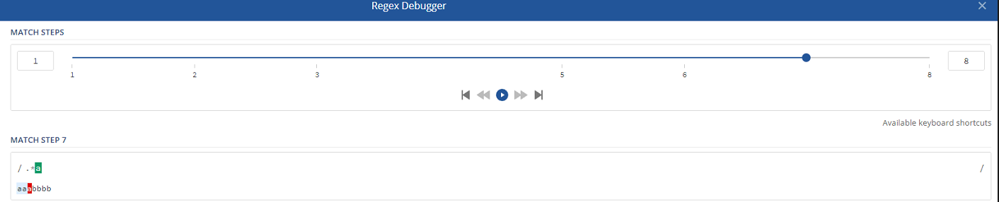
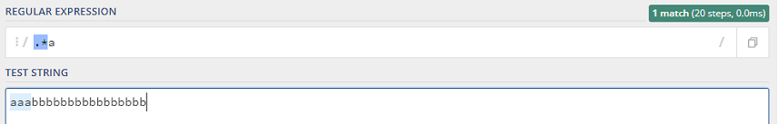
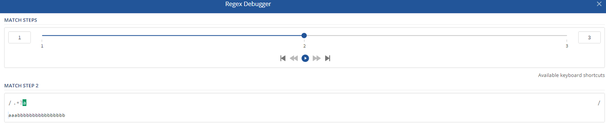
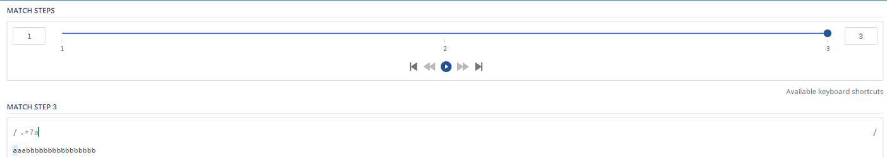
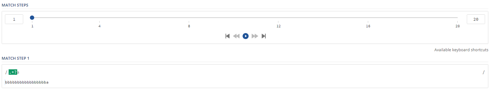
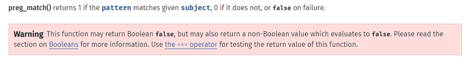

最近发现对PCRE的回溯机制理解还是很模糊，决定再仔细复习记录下

## DFA与NFA

先简单了解下DFA与NFA这两种正则引擎：DFA为确定性有穷自动机，是文本主导，NFA为非确定性有穷自动机，是表达式主导。

DFA与NFA机制上的不同带来3种主要影响：

1. DFA对于文本串里的每一个字符只需扫描一次，比较快，但特性较少；NFA要翻来覆去吃字符、吐字符，速度慢，但是特性丰富，所以反而应用广泛，当今主要的正则表达式引擎，如Perl、Ruby、Python的re模块、Java和.NET的regex库，都是NFA的。
2. NFA急于邀功请赏，所以最左子正则式优先匹配成功，因此偶尔会错过最佳匹配结果；DFA则是“最长的左子正则式优先匹配成功”。
3. NFA可能会陷入递归调用的陷阱而表现得性能极差。

**针对第2点，这里举个例子来说明：**

比如正则表达式`/aaa|aaabbb/`与字符串`aaabbbccc`匹配，在php和awk的匹配结果就不一样。

php的pcre库是NFA引擎，**匹配结果是aaa**。

```php
php > preg_match('/aaa|aaabbb/','aaabbbccc',$matches);
php > print_r($matches);
Array
(
    [0] => aaa
)
```

awk使用的是DFA引擎，这里通过awk的sub函数将正则匹配中的内容替换为`(replace)`，可以看到**匹配中的是aaabbb**。

```sh
root@p0melo:/tmp# cat 1.txt
aaabbbccc
root@p0melo:/tmp# awk 'sub(/aaa|aaabbb/,"(replace)")' 1.txt
(replace)ccc
root@p0melo:/tmp#
```

所以说NFA是最左子式匹配，而DFA是最长左子式匹配。

针对第1和第3点递归和性能的影响，就不得不提到NFA匹配的回溯机制。

## 贪婪模式与非贪婪模式

正则表达式具有下面量词就是贪婪模式，在量词后面直接加上一个问号？就是非贪婪模式。

　　量词：{m,n}：m到n个

　　　　　*：任意多个

　　　　　+：一个到多个

　　　　　？：0或一个

这里我们举个贪婪模式的例子，表达式`/.*a/`与`aaabbb`匹配，由于是**贪婪模式**，`.*`会把aaabbb全部吃掉，然后再从最后一个b往回吐，一直吐到第3个a时匹配上了，所以返回aaa。我们可以通过[在线工具](https://regex101.com/debugger)debug下匹配步骤，可以看到，第7步吐到了字符串第3个a的位置，第8步表达式最后一个a与字符串的第3个a匹配才配成功，表达式匹配完了也就停止了，所以匹配结果是aaa。



并且会随着b的数量增多，吐（回溯）的次数也会增多。



再来看看**非贪婪模式**，正则改用`/.*?a/`，可以看到总共只需要匹配3步，在第1步`.*?`与字符串匹配时，由于是非贪婪模式，这里会把`.*?`放一放，优先用后面的表达式匹配，所以第2步表达式最后一个a与字符串第一个a匹配，匹配成功，然后往下匹配。



第3步表达式结束符与字符串第2个a匹配不上，匹配结束，所以匹配结果为a。



当我们字符串改为`bbbbbbbbbbbbbbbbba`，可以看到匹配步数增加到了20次，这是因为`.*?`为非贪婪模式，所以优先由表达式中的a与字符串第一个字符b匹配，匹配不上，再由`.*?`匹配，由于非贪婪模式，又优先a与第二个b匹配，匹配失败......一直重复，直到表达式a与字符串最后一个a匹配上为止。



所以通过这个例子可以看出来，贪婪模式和非贪婪模式都会有回溯机制。

## 回溯机制引发的问题

上面例子的回溯次数会随着字符b的数量增加而增加，当回溯次数非常大时，就可能会导致拒绝服务攻击（redos），PHP给pcre设定了一个回溯次数上限pcre.backtrack_limit来防止redos问题。我们可以通过var_dump(ini_get('pcre.backtrack_limit'));的方式查看当前环境下的上限：

```php
php > var_dump(ini_get('pcre.backtrack_limit'));
string(7) "1000000"
```

当回溯次数大于1000000会有什么问题呢？

```php
php > var_dump(preg_match('/.*a/s','a'.str_repeat('b',1000000)));  // 贪婪模式
bool(false)
php > var_dump(preg_match('/.*?a/s',str_repeat('b',1000000).'a'));  // 非贪婪模式
bool(false)
```

这里返回了false，并非正常匹配上返回的1，不匹配返回的0，官方文档也对这现象做出了解释：



所以我们也可以通过该特性绕过一些限制，比如基于php的waf：

```php
if(preg_match('/SELECT.+FROM.+/is', $input)) {
    die('SQL Injection');
}
```

这里可以输入类似`SELECT * FROM XXX /*aaaaaaa......`的payload使回溯次数超过限制，从而返回false绕过if判断，类似还有非贪婪模式的错误用法：

```php
if(preg_match('/UNION.+?SELECT/is', $input)) {
    die('SQL Injection');
}
```

 可以使用`UNION/*aaaaa......*/SELECT`增加回溯次数来绕过限制。

**修复方法**

我们可以通过全等号来判断`preg_match`的返回值

```php
if(preg_match('/UNION.+?SELECT/is', $input) === 1) {
    die('SQL Injection');
}
```

## 参考链接

[正则引擎：DFA与NFA](https://blog.csdn.net/liuxiao723846/article/details/83308081)

[DFA与NFA的比较](https://blog.csdn.net/zpflwy1314/article/details/82665254)

[PHP利用PCRE回溯次数限制绕过某些安全限制](https://www.leavesongs.com/PENETRATION/use-pcre-backtrack-limit-to-bypass-restrict.html)

