# 漏洞介绍

**CVE编号**

CVE-2022-22965

**影响范围**

- JDK >= 9
- 使用Apache Tomcat 作为Servlet容器，并且使用传统的war包部署方法
- Spring Framework 5.3.0 - 5.3.17，5.2.0 - 5.2.19，以及更早的版本，或其他包含`spring-webmvc` or `spring-webflux`依赖的应用

# 漏洞复现

拉取此漏洞的[vulhub代码](https://github.com/vulhub/vulhub/tree/master/base/spring/spring-webmvc/5.3.17)进行复现，我本地环境是`jdk11+tomcat8.5.39`

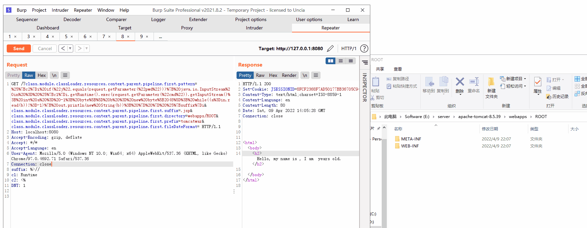

# 漏洞分析

## 基础知识

### Java内省机制

Java内省(Introspector)机制就是JDK提供的一套API来查找、设置`JavaBean`的属性，只要有 `getter`/`setter` 方法中的其中一个，那么 Java 的内省机制就会认为存在一个属性，内省的核心类就是`Introspector`类。

这里我们新建一个名为`Person`的`JavaBean`，使用内省的方法来调用`Person`类所有属性以及属性的读写方法

```
public class Person {
    private String name;
    private Integer age;

    public String getName() {
        return name;
    }

    public void setName(String name) {
        this.name = name;
    }

    public Integer getAge() {
        return age;
    }

    public void setAge(Integer age) {
        this.age = age;
    }
}
```

```java
import java.beans.BeanInfo;
import java.beans.Introspector;
import java.beans.PropertyDescriptor;

public class Test {
    public static void main(String[] args) throws Exception {
        BeanInfo info = Introspector.getBeanInfo(Person.class);
        PropertyDescriptor[] properties =
                info.getPropertyDescriptors();
        for (PropertyDescriptor pd : properties) {
            System.out.println(pd.getName());
            System.out.println("    [*]" + pd.getReadMethod());
            System.out.println("    [*]" + pd.getWriteMethod());
        }
    }
}

```

运行结果除了包含`Person`类的属性和属性的读写方法之外，另外还包括`class`属性以及`getClass`方法，这是因为呢？

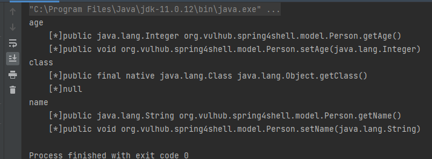

### 为什么会有class属性？

查看`Introspector.getBeanInfo(Class<?> beanClass)`方法，会将`beanClass`传入`Introspector`构造方法，并调用`Introspector`实例`getBeanInfo()`方法

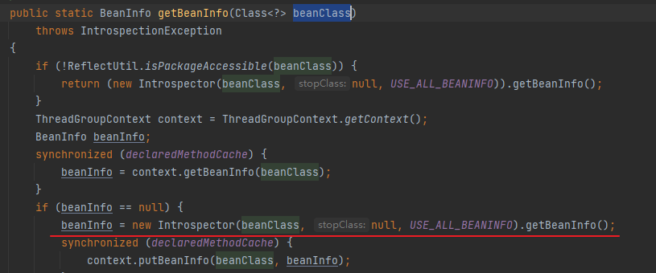

先跟入`Introspector`构造方法，`stopClass`为空就会获取父类`java.lang.Object`的`BeanInfo`并赋给`superBeanInfo`

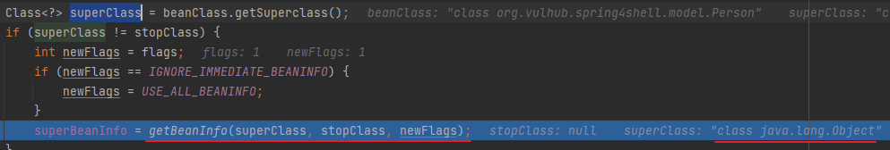

完成构造方法后调用`getBeanInfo()`，`getBeanInfo()`方法里面的`getTargetMethodInfo()`、`getTargetEventInfo()`、`getTargetPropertyInfo()`几个方法都会先获取`superBeanInfo`中的值并加到自己的`BeanInfo`中

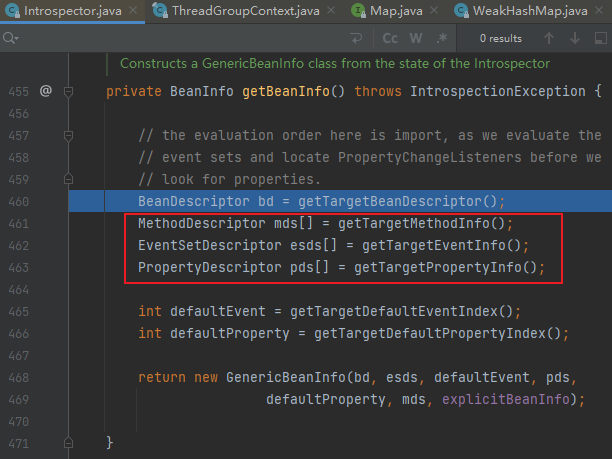

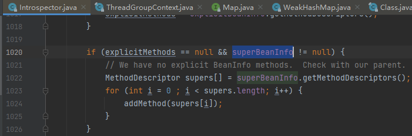

因为`java.lang.Object`存在一个`getClass()`方法，所以内省机制会认为有`class`属性。这也就解释了为什么`Person`类有`class`属性和`getClass`方法了。

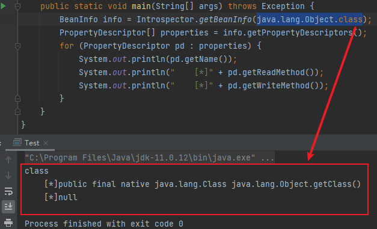

### SpirngBean

`SpringBean`可以当成`JavaBean`的升级版，由`Spring`框架的`ApplicationContext`操控`SpringBean`，`ApplicationContext`也称控制反转（IoC）容器，是`Spring`框架的核心。控制反转就是**用户将对象转为实例过程，变成了容器生产实例，然后通过实例去注入到对应的对象的过程**。

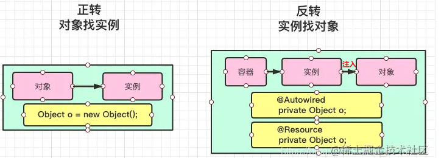

简单的可以将`Spring`容器理解为工厂，`SpringBean`的生产过程就是我们定义好什么产品（Bean）需要什么样的原材料（Bean中的属性）这样的配置信息，`Spring`容器负责将原材料生产（实例化）为产品并存储（Cache）

> 在SpringBean要使用时，第一步就是从SpringBean的注册表中获取Bean的配置信息，然后根据配置信息实例化Bean，实例化以后的Bean被映射到了Spring容器中，并且被存储在了Bean Cache池中，当应用程序要使用Bean时，会向Bean Cache池发起调用。

参考`panda`大佬画的一张图

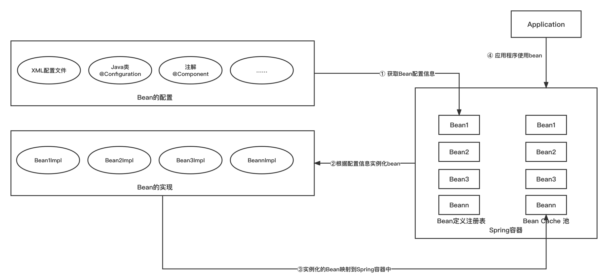

## 关键代码分析

根据历史漏洞分析[文章](http://rui0.cn/archives/1158?wglebi=4dr1b)，看下通到`CachedIntrospectionResults`的调用链，可以看到在`getPropertyAccessorForPropertyPath`递归了8次

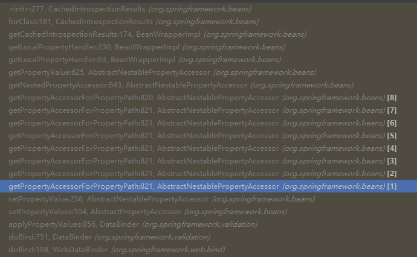

`getPropertyAccessorForPropertyPath`方法根据分隔符`.`将传入的字符串分割，并从左往右递归处理嵌套属性（嵌套结构的理解可以[参考文章](https://www.cnblogs.com/binarylei/p/10267928.html)），所以如果我们想通过class去调用classLoader的属性，只需要通过class.classLoader的方式即可

```java
protected AbstractNestablePropertyAccessor getPropertyAccessorForPropertyPath(String propertyPath) {
        // 获取嵌套属性的第一个属性
        // 比如对于属性: foo.bar[0].name
        // 首先获取到 foo 的索引位置
        // getFirstNestedPropertySeparatorIndex是详细的方法
        int pos = PropertyAccessorUtils.getFirstNestedPropertySeparatorIndex(propertyPath);
        // Handle nested properties recursively.
        //递归处理嵌套属性
        if (pos > -1) {
            // 获取所在的属性和对应的name
            String nestedProperty = propertyPath.substring(0, pos);
            String nestedPath = propertyPath.substring(pos + 1);
            AbstractNestablePropertyAccessor nestedPa = getNestedPropertyAccessor(nestedProperty);
            //递归调用
            return nestedPa.getPropertyAccessorForPropertyPath(nestedPath);
        }
        else {
            return this;
        }
    }
```

所以我们可以通过`Tomcat Access Log`来写shell。`Tomcat Access Log`是通过 `server.xml` 配置

```xml
<Valve className="org.apache.catalina.valves.AccessLogValve" directory="logs" prefix="access." suffix=".log" 
        pattern="%h %l %u %t "%r" %s %b "%{Referer}i" "%{User-Agent}i" %{X-Forwarded-For}i "%Dms"" resolveHosts="false"/>
```

根据前面对`SpirngBean`和内省机制的理解，通过xml文件加载的配置属性，实际上也是可以通过内省机制修改的，Tomcat具体有哪些属性可以参考[官方文档](https://tomcat.apache.org/tomcat-8.5-doc/config/valve.html)，通过修改下面的几个属性可创建任意后缀名的文件，即可写入一个shell

```java
class.module.classLoader.resources.context.parent.pipeline.first.directory =
class.module.classLoader.resources.context.parent.pipeline.first.prefix =
class.module.classLoader.resources.context.parent.pipeline.first.suffix = 
class.module.classLoader.resources.context.parent.pipeline.first.fileDateFormat =
```

## 为什么只有 >= jdk9受影响？

此漏洞其实算是`CVE-2010-1622`的JDK高版本利用，`CVE-2010-1622`的修复增加了`class.classLoader`的黑名单限制，而`jdk9`以下版本只能通过`class.classLoader`利用，`pd.getName`为`classLoader`时，`beanClass`为`Class`，即所以没法利用，黑名单判断代码如下

```java
if (Class.class != beanClass || !"classLoader".equals(pd.getName()) && !"protectionDomain".equals(pd.getName())) {
    ...... // 正常逻辑
}
```

`jdk9`引入了[模块系统](https://blog.csdn.net/charles_neil/article/details/114460702)，可通过`class.module.classLoader`使得当`pd.getName`为`classLoader`时，`Class.class != beanClass`，从而不走后面`||`判断逻辑导致绕过

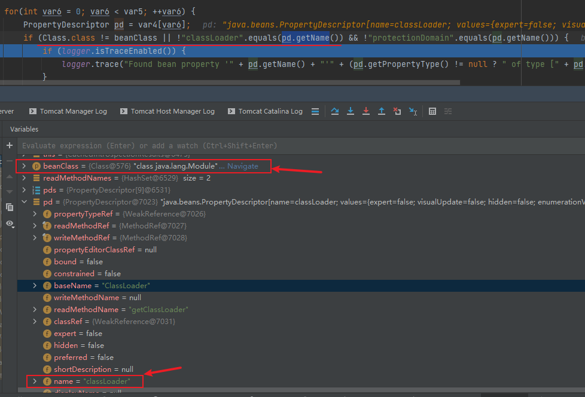

# 补丁分析


# 踩坑记录

由于本地调试环境问题，导致调试前踩了不少坑，这里记录下

### **1.CATALINA_BASE**

`tomcat`默认配置的`CATALINA_BASE`和`CATALINA_HOME`是同一目录，这两者的区别可参考[官网介绍](https://tomcat.apache.org/tomcat-8.5-doc/introduction.html#CATALINA_HOME_and_CATALINA_BASE)

用idea配置tomcat后，启动时`CATALINA_BASE`并没有和`CATALINA_HOME`在同一目录，而是在C盘的用户目录下

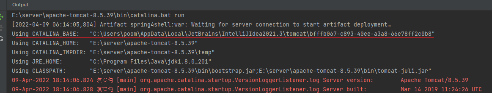

写入的`shell`在`CATALINA_BASE`下，而不是tomcat的安装目录`CATALINA_HOME`下，这就导致生成的shell访问不到

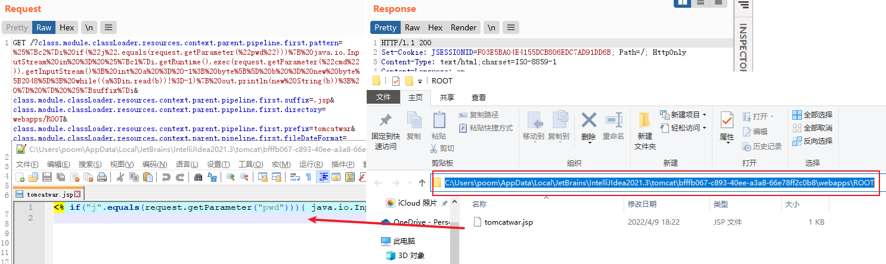

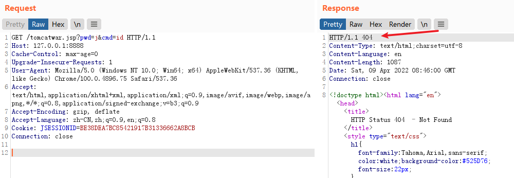

**解决办法**

idea中配置tomcat环境变量，指定`CATALINA_BASE`为本地tomcat目录，然后重启即可

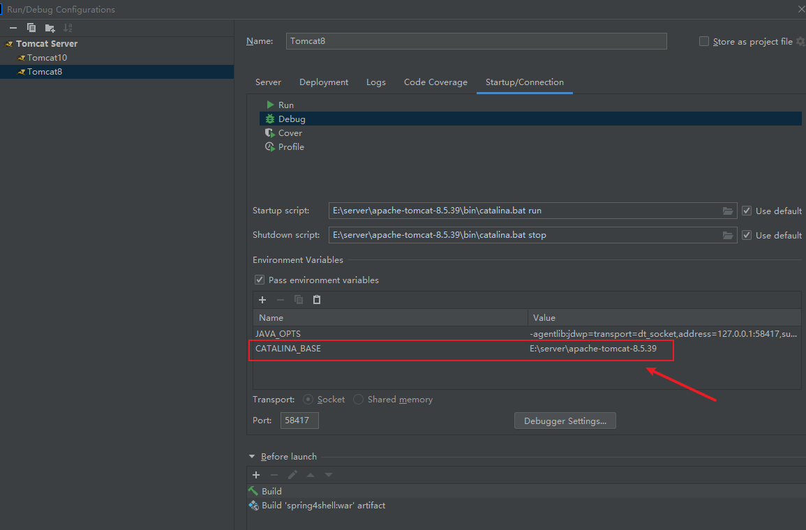

### 2.idea配置tomcat端口不生效

为了解决上一个问题，idea配置了`CATALINA_BASE`后，idea中不管怎么设置tomcat服务的`HTTP port`，运行时始终都是以tomcat默认的`8080`端口启动（一直以为是我项目配置问题，这里卡了半天也没整出来，吐了...）

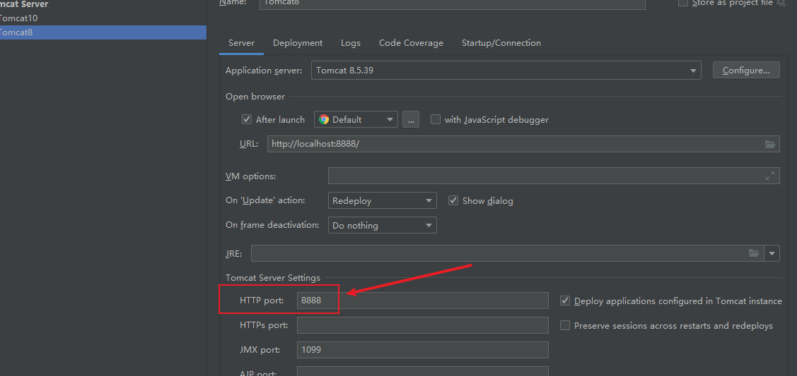

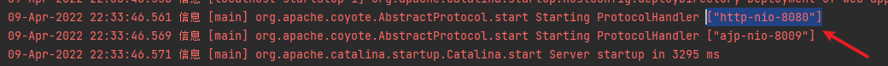

还不清楚具体是什么原因导致的，如果要修改端口只能修改tomcat的`server.xml`配置文件，或者直接访问默认的`8080`端口

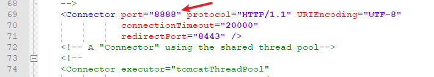

# 参考

http://rui0.cn/archives/1158

https://xz.aliyun.com/t/11129#toc-13

https://tttang.com/archive/1532/

https://spring.io/blog/2022/03/31/spring-framework-rce-early-announcement

https://github.com/vulhub/vulhub/tree/master/base/spring/spring-webmvc/5.3.17

https://github.com/vulhub/vulhub/tree/master/spring/CVE-2022-22965

https://blog.csdn.net/Honnyee/article/details/85337647

https://juejin.cn/post/6966158157202587662
