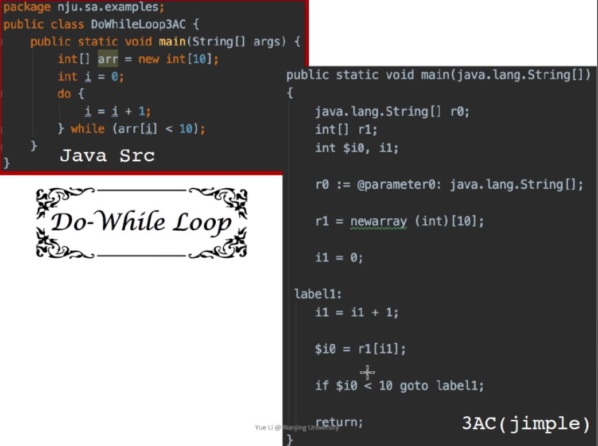
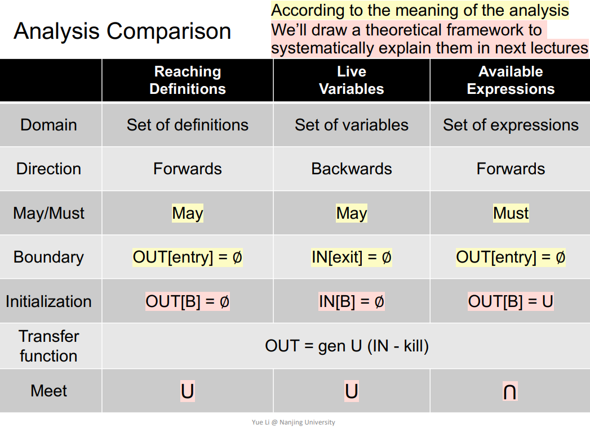

注：⭐️符号代表重要的知识点，课程还未学习完，笔记更新中ing

## 1. Intermediate Representation(IR)（第二节课）

### 1.1 AST VS IR

编译器运行流程

程序到静态分析的流程理解：**程序->IR(3addr 3地址码)->CFG->静态分析**

AST与IR的区别

### 1.2 What IR(Soot's IR:Jimple)

**demo1:do while loop**

**demo2:method call**

**demo3:class**

### 1.3 Control Flow Graph(CFG)

#### 1.3.1 graph nodes : basi，c blocks(BB)

##### **Basic Blocks定义**

入口和出口都是唯一的最大3地址码顺序集合

##### ⭐️**判别Basic Blocks方法**

**step1 ：先找到所有BB的入口(leaders)，可通过下面3中方法判定**

- **程序中的第一条指令**
- **任何被jump (goto) 到的目标都为leader**
- **任何紧跟jump语句后的语句都为leader**

**step2：一个leader和后面的所有指令，直到下一个leader为止**

##### **例子：3AC转换BBs**

#### 1.3.2 Graph edge 

##### ⭐️如何给BBs加边

**1.不管有无条件的jump，起点与目标的连线**

**2.正常的无条件指令，按执行顺序依次连线**

**3.第1条的连线用jump指令所在的BB连线代替，如下图A与B**

##### 例子

## 2.  Data Flow Analysis - Applications （第三、四节课）

下面介绍3钟不同的数据流分析算法，通过算法可以解出CFG可流通的路径，算法不同，路径结果也不同

### 2.1 前置知识

### 2.2 Reaching Definitions Analysis

#### Reaching Definitions 定义解析

#### ⭐️Reaching Definitions 实现算法

#### Reaching Definitions 实例演示

每一个变量赋值表达式子用都代表一个Definition，这里用Dn表示，蓝色代表变量x，红色代表y，黑色代表m，绿色代表z

### 2.3 Live Variables Analysis （第四节课）

#### Live Variables 定义解析

####  ⭐️Live Variables 实现算法

#### Live Variables 实例演示

### 2.4 Available Expressions Analysis

#### Available Expressions 定义解析

#### ⭐️Available Expressions 实现算法

#### Available Expressions 示例演示

### ⭐️2.5 三种数据流分析应用对比

## 3. Data Flow Analysis - Foundations （第五、六节课）

### ⭐️3.1 Iterative Algorithm, Another View

前面3中数据流分析算法满足**不动点定律**

### 3.2 Partial Order

### 3.3 Upper and Lower Bounds

### ⭐️3.4 Lattice, Semilattice, Complete and Product Lattice

- **Lattice(格)：poset中的任意2个元素，都存在最小上界和最大下界**
- **Semilattice(半格)：poset中的任意2个元素，只有上界或只有下界**
- **Complete Lattice(完全格)：一个Lattice的任意子集都存在最小上界和最大下界，则称为Complete Lattice**
  - 其实finite的lattice一定是Complete Lattice（反过来不一定）
- **Product Lattice：可理解为多个Lattice的笛卡尔积**
  - Product Lattice也是一个Lattice
  - 构成Product Lattice的每一个Lattice都是Complete的，那么这个Product Lattice也是Complete

.

## 参考

[课程视频](https://space.bilibili.com/2919428/channel/seriesdetail?sid=1006553&ctype=0)

[课件](https://pascal-group.bitbucket.io/teaching.html)

